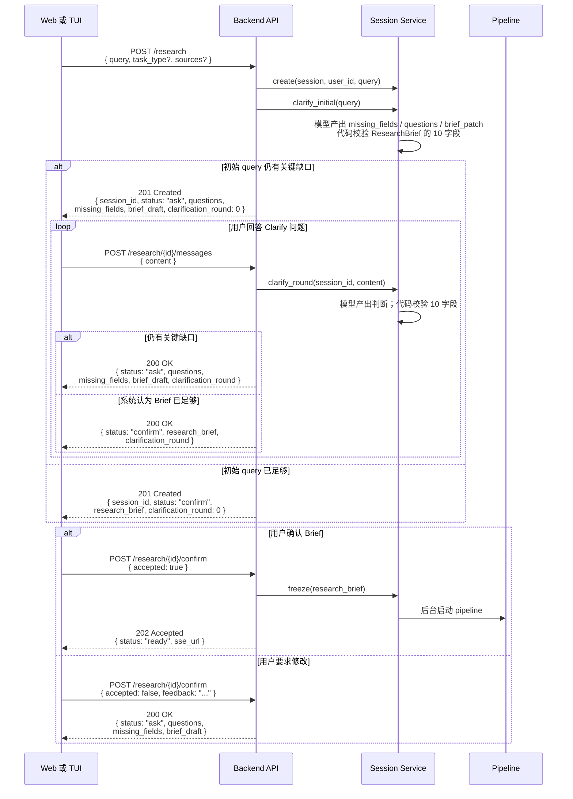

# Research API 契约

> **历史设计（已替代）**：当前后端与 Web/pi-tui 的 HTTP/SSE 契约见 [mono/api-contract.md](../mono/api-contract.md)，全局上下文见 [mono/architecture.md](../mono/architecture.md)。下文保留旧讨论记录，不作为实现依据。
> 数据对象的语义见 [ResearchBrief 契约](researchbrief.md) 与 [统一报告骨架](report-skeleton.md)。
> `specs/001-deep-research-agent/contracts/api.md` 同为历史入口；涉及状态、字段、确认、恢复等冲突时，以 mono 五份文档为准。

## 1. 交互总览



## 2. 通用规则

- API 基路径由部署环境决定；下文路径均相对该基路径。
- JSON 请求必须带 `Content-Type: application/json`，JSON 响应必须带 `Content-Type: application/json`。
- 受保护请求使用 `access_token` cookie。除 SSE 外，服务端也可接受
  `Authorization: Bearer <access_token>`；客户端不得把 token 放在 URL 或日志中。
- 生产 HTTPS 响应的 cookie 必须带 `HttpOnly`、`Secure`、`SameSite=Lax` 与 `Path=/`；本机 HTTP 调试可省略 `Secure`，其余约束不变。
- `session_id` 是 UUID 字符串。会话归属不匹配与会话不存在均返回相同的 `404 session_not_found`，避免泄漏其他用户的会话存在性。
- 所有时间戳使用 ISO 8601 UTC 字符串。
- 客户端不得对 `POST /research/{session_id}/messages` 自动重试；在引入显式幂等键前，重复提交可能代表另一轮用户回答。

失败响应统一为：

```json
{
  "error": {
    "code": "machine_readable_code",
    "message": "面向用户的简短说明"
  }
}
```

- `401 unauthenticated`：缺少、失效或伪造的认证凭证。
- `404 session_not_found`：会话不存在或不属于当前用户。
- `409 invalid_session_state`：对已冻结、已取消或终态会话执行不允许的状态转换。
- `422 validation_error`：请求体字段缺失、类型错误或不符合约束。
- `429 rate_limited`：超出认证、Clarify 或研究预算限制。
- `500 internal_error`：未被处理的服务端错误；不得向客户端返回密钥、堆栈或内部地址。

## 3. 认证

### `POST /auth/register`

请求：

```json
{
  "email": "researcher@example.edu",
  "password": "at-least-8-characters"
}
```

- `email` 为 3–254 字符的邮箱地址。
- `password` 为 8–128 字符；服务端只保存密码哈希。

成功响应：`201 Created`

```json
{
  "user_id": "uuid"
}
```

已注册邮箱返回 `409 email_already_registered`。

### `POST /auth/login`

请求：

```json
{
  "email": "researcher@example.edu",
  "password": "at-least-8-characters"
}
```

成功响应：`200 OK`，同时写入 `Set-Cookie: access_token=...`。

```json
{
  "access_token": "JWT",
  "token_type": "bearer"
}
```

`access_token` 供非 SSE 的程序化客户端使用；Web 与 TUI 的 SSE 连接使用登录响应设置的 cookie / 内存 cookie jar。邮箱或密码不正确返回 `401 invalid_credentials`。

## 4. 研究会话与 Clarify

### `POST /research`

此请求创建会话，并以原始 `query` 运行第一轮 Clarify；它不启动 pipeline。

请求：

```json
{
  "query": "比较 Transformer 与 CNN 在入侵检测中的可验证差异",
  "task_type": "method_differentiation",
  "sources": ["papers", "web", "knowledge_base"]
}
```

- `query` 必填，非空字符串。
- `task_type` 可省略，或为 `idea_exploration`、`method_differentiation`、`evaluation_design`、`reviewer_response`；省略时由 Clarify 决定。
- `sources` 可省略；每项是客户端希望纳入的来源类别或已知知识库标识，最终是否采用由 Brief 冻结。

若初始 query 仍缺少关键字段，成功响应为 `201 Created`：

```json
{
  "session_id": "uuid",
  "status": "ask",
  "questions": [
    "你希望比较哪些候选技术路线？"
  ],
  "missing_fields": ["comparison_scope"],
  "brief_draft": {
    "decision_goal": "选择可验证的技术路线"
  },
  "clarification_round": 0
}
```

若初始 query 已可形成完整 Brief，仍返回 `201 Created`，但状态为 `confirm`：

```json
{
  "session_id": "uuid",
  "status": "confirm",
  "research_brief": {
    "task_type": "method_differentiation",
    "decision_goal": "...",
    "research_object": "...",
    "scope": "...",
    "comparison_scope": "...",
    "claims_to_verify": "...",
    "evidence_requirements": "...",
    "conclusion_boundary": "...",
    "deliverable": "...",
    "assumptions": "..."
  },
  "clarification_round": 0
}
```

### `POST /research/{session_id}/messages`

每次请求只提交一条用户回答并推进一轮 Clarify。

请求：

```json
{
  "content": "目标是选择可在公开 CERT 数据上验证的路线；希望交付比较矩阵和实验建议。"
}
```

当仍需要关键输入时，成功响应为 `200 OK`：

```json
{
  "status": "ask",
  "questions": [
    "你希望比较哪些候选技术路线？"
  ],
  "missing_fields": ["comparison_scope"],
  "brief_draft": {
    "decision_goal": "选择可验证的技术路线"
  },
  "clarification_round": 1
}
```

当信息足够时，服务端返回完整的十字段 ResearchBrief，等待用户审核。成功响应为 `200 OK`：

```json
{
  "status": "confirm",
  "research_brief": {
    "task_type": "method_differentiation",
    "decision_goal": "选择可验证的技术路线",
    "research_object": "...",
    "scope": "...",
    "comparison_scope": "...",
    "claims_to_verify": "...",
    "evidence_requirements": "...",
    "conclusion_boundary": "...",
    "deliverable": "...",
    "assumptions": "..."
  },
  "clarification_round": 2
}
```

`research_brief` 必须满足 [ResearchBrief 契约](researchbrief.md) 的全部十个字段；客户端不得用 `brief_draft` 替代它判断或确认冻结。

### `POST /research/{session_id}/confirm`

客户端只在收到 `status: "confirm"` 后调用此端点。确认请求使用：

```json
{
  "accepted": true
}
```

服务端再次校验 Brief、冻结它，并在后台启动 pipeline。成功响应为 `202 Accepted`：

```json
{
  "session_id": "uuid",
  "status": "ready",
  "sse_url": "/research/uuid/events"
}
```

用户要求修改时使用：

```json
{
  "accepted": false,
  "feedback": "请把比较范围限定为公开 CERT 数据集，并明确算力限制。"
}
```

服务端将反馈带回 Clarify，返回 `200 OK` 的 `ask` 响应。未处于 `confirm` 状态时调用本端点返回 `409 invalid_session_state`。

## 5. Pipeline 事件流

### `GET /research/{session_id}/events`

仅当确认端点返回 `ready` 与 `sse_url` 后订阅。响应为 `200 OK` 和 `Content-Type: text/event-stream`。

每个 SSE 帧使用标准字段：

```text
id: event-uuid
event: phase
data: {"session_id":"uuid","timestamp":"2026-10-04T10:00:00Z","phase":"research","message":"开始检索"}

```

- `phase`：`phase` 为 `plan`、`research`、`analyze`、`write`、`review`、`done` 之一，附 `message`。
- `progress`：包含 `section_id`、`stage`，可选 `results`、`chart`。
- `rework`：包含 `issue_id`、`action`、`target`。
- `error`：包含 `code`、`message` 与 `recoverable`。
- `done`：包含 `status`（`completed` 或 `cancelled`）和可空的 `final_report_url`。

SSE 是进度投影，不是持久事件日志。V1 不保证事件回放；断线后客户端必须通过会话状态与报告接口重新取得事实状态，而不是把缺失事件推断为成功。

## 6. 状态、报告与取消

### `GET /research/{session_id}`

成功响应：`200 OK`

```json
{
  "session_id": "uuid",
  "status": "clarify",
  "phase": null,
  "clarification_round": 1
}
```

`status` 为 `clarify`、`confirm`、`running`、`completed`、`failed`、`cancelling` 或 `cancelled`；`phase` 在 pipeline 启动前为 `null`。

### `GET /research/{session_id}/report`

仅在完成报告后成功返回 `200 OK`：

```json
{
  "session_id": "uuid",
  "report": "# 研究标题\\n\\n..."
}
```

报告未就绪返回 `409 report_not_ready`，而不是空报告。

### `POST /research/{session_id}/cancel`

请求体为空 JSON 对象：

```json
{}
```

成功响应：`202 Accepted`

```json
{
  "session_id": "uuid",
  "status": "cancelling"
}
```

取消为异步请求；客户端必须继续读取 SSE 或查询状态，直到得到 `cancelled` 或其他终态。
