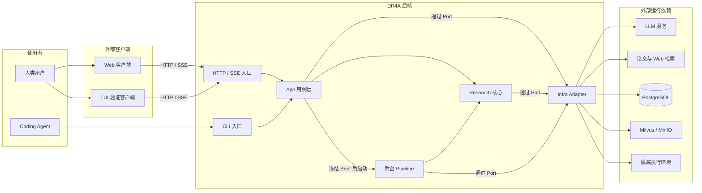
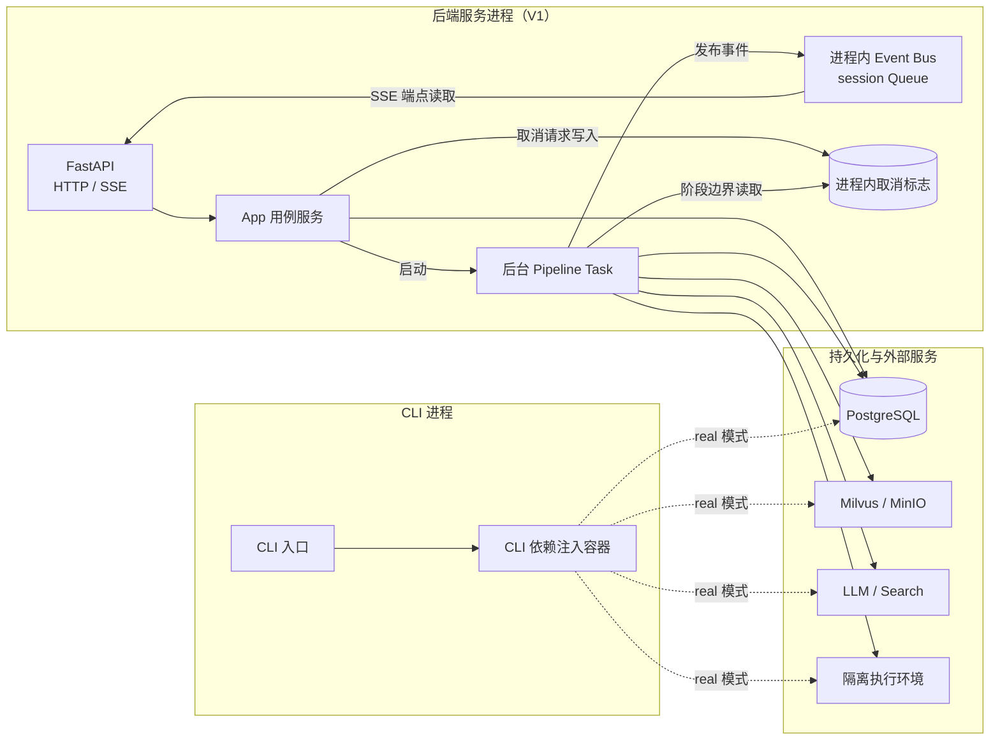
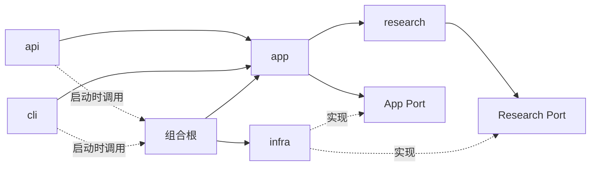

# DR4A 后端架构设计

> 状态：编写中。第 1–2 节已形成初稿。第 3–5 节仍是写作骨架。本文不是当前权威设计来源。
>
> 本文描述目标架构。本文不把未完成的目标设计表述为当前实现。

## 1. 系统上下文与架构原则

DR4A 是面向学术研究的 Deep Research 系统。后端把研究请求转换为可检查的研究过程和研究报告。系统必须保留结论、证据和来源之间的关系。

后端先收敛研究任务。用户确认 ResearchBrief 后，后端才启动研究 Pipeline。Pipeline 负责规划、检索、分析、写作和审阅。

### 1.1 文档目的与设计范围

本文定义 DR4A 后端的目标架构。本文回答以下问题：

- DR4A 后端的边界在哪里。
- 后端包含哪些主要模块。
- 每个模块负责什么。
- 模块之间允许怎样依赖。
- 哪个组件控制流程。
- 哪个组件只执行任务。
- 外部能力怎样接入后端。

本文覆盖 HTTP/SSE 入口、CLI 入口、App 用例层、Research 核心、后台 Pipeline 和 Infra Adapter。Web 和 TUI 是外部客户端。外部模型、检索服务和存储系统也是系统边界之外的运行依赖。

本文不定义以下内容：

- HTTP、SSE 和 CLI 的字段级契约。
- 领域实体和数据库表的字段。
- 完整的数据流和状态转换步骤。
- 错误码、重试参数和降级规则。
- 部署命令和运维步骤。

这些内容由其他 mono 文档定义。第 5 节定义文档之间的边界。

<!--
设计来源：
- docs/architecture/README.md:3-12,26-32
- specs/001-deep-research-agent/plan.md:7-13
- specs/001-deep-research-agent/spec.md:160-169
-->

### 1.2 核心架构原则

DR4A 后端使用以下原则。

1. **分离职责。** `api` 只转换网络输入和输出。`app` 控制用例。`research` 保存研究规则。`infra` 连接外部系统。
2. **每个生命周期只有一个事实源。** Clarify 使用 SessionState。Pipeline 使用 PipelineState。SSE 事件只是状态变化的投影。SSE 事件不是持久事实源。
3. **代码控制流程。** Machine 使用确定性规则计算状态转换。LLM 只返回结构化判断。LLM 不直接选择下一阶段。
4. **Agent 只执行任务。** Agent 接收有限输入并返回结果。Agent 不修改全局状态。Agent 不保存跨轮状态。Agent 不启动其他阶段。
5. **通过 Port 使用外部能力。** 核心模块依赖 Port。Infra Adapter 实现 Port。核心模块不得直接依赖外部 SDK。
6. **冻结是生命周期边界。** Clarify 产生 ResearchBrief 草稿。用户确认后，系统冻结 ResearchBrief。冻结后的 ResearchBrief 是 Pipeline 的只读输入。
7. **执行必须有界。** 检索预算、Clarify 轮数和返工轮数必须有上限。系统必须保存阶段快照。中断后的任务必须从持久状态恢复。

这些原则限制模块的设计。后续章节不能定义与这些原则冲突的依赖或控制路径。

<!--
设计来源：
- specs/001-deep-research-agent/plan.md:43-78
- specs/001-deep-research-agent/research.md:5-15
- specs/001-deep-research-agent/spec.md:106-126
- specs/001-deep-research-agent/data-model.md:6-15,81-112
-->

### 1.3 系统边界与外部参与者

下图显示 DR4A 后端的系统边界。它不显示字段级 API，也不显示完整 Pipeline 数据流。



*图 1　DR4A 系统上下文图。箭头表示访问关系或运行时调用。*

系统边界使用以下规则：

- Web 和 TUI 位于后端之外。它们只能使用公开 HTTP/SSE 契约。
- TUI 是端到端验证客户端。TUI 不导入 Python 后端模块。
- CLI 位于 DR4A 代码边界之内。CLI 是面向 Coding Agent 和开发者的入口。
- CLI 与 HTTP 入口调用相同的应用用例。CLI 不实现第二套研究流程。
- 后台 Pipeline 是后端内部组件。它不是独立的公共服务。
- `app` 和 `research` 通过 Port 使用外部能力。Infra Adapter 负责协议转换。
- PostgreSQL、Milvus、MinIO、LLM、检索服务和隔离执行环境不包含 DR4A 领域规则。
- TUI 的匿名开发模式不能改变正式 API 契约。

<!--
设计来源：
- specs/001-deep-research-agent/plan.md:15-41,107-144
- docs/contracts/research-api.md:1-48
- specs/002-cli/plan.md:7-17,69-78
- specs/003-textual-tui/plan.md:5-17,28-44
- specs/003-textual-tui/research.md:21-31
-->

## 2. 系统结构与依赖关系

DR4A 后端有两个结构视角。运行时视角描述进程、后台任务和外部服务。源代码视角描述模块、职责和依赖规则。两个视角不能互相替代。

### 2.1 运行时组件

V1 使用一个后端服务进程。该进程运行 FastAPI、App 用例服务、后台 Pipeline Task、Event Bus 和取消状态。Event Bus 和取消状态只存在于该进程中。

CLI 使用独立 Python 进程。CLI 创建自己的依赖注入容器。CLI 与后端服务复用相同的 `app`、`research` 和 `infra` 模块。两个进程不共享内存对象。



*图 2　V1 运行时组件交互图。箭头表示运行时调用或数据移动。*

各运行时组件使用以下规则：

- FastAPI 处理 HTTP 请求和 SSE 连接。
- App Service 处理同步用例。它可以启动后台 Pipeline。
- Pipeline Task 执行长时间研究任务。它不能阻塞启动请求。
- Event Bus 只传输瞬态进度。它不保存业务真相。
- PostgreSQL 保存会话、冻结 Brief、报告和阶段快照。
- CLI 的 fake 模式不连接真实外部服务。
- CLI 的 real 模式可以连接真实 Adapter。该模式可能写入持久化存储。
- V1 的进程内状态要求后端使用单个 worker。多 worker 会产生相互隔离的 Event Bus 和取消状态。

<!--
设计来源：
- specs/001-deep-research-agent/plan.md:15-41,107-114
- specs/001-deep-research-agent/research.md:17-39
- specs/002-cli/plan.md:7-17,44-67
- specs/003-textual-tui/plan.md:5-17
-->

### 2.2 后端模块、目录与职责

DR4A 后端使用四个核心模块。CLI 是第二个入口模块。它与 `api` 平级。

| 模块 | 主要职责 | 不负责的内容 |
|---|---|---|
| `api` | 定义 FastAPI Router、DTO、认证依赖和 SSE 响应 | 研究规则、状态转换和外部服务实现 |
| `cli` | 解析命令、选择运行模式并显示结果 | 新的研究流程和独立业务规则 |
| `app` | 执行用例、管理会话、编排 Pipeline、保存快照并发布事件 | HTTP 表示、模型推理细节和外部协议细节 |
| `research` | 定义研究状态、状态机、研究事件、Agent 和 Research Port | 数据库、网络、文件系统和进程管理 |
| `infra` | 实现 Port，并连接数据库、模型、检索、向量库和沙箱 | 研究阶段选择和业务政策 |

目标目录结构如下。该结构是代码迁移目标，不代表当前目录已经完成重命名。

```text
backend/
├── api/
│   ├── main.py
│   ├── deps.py
│   ├── routers/
│   ├── dto/
│   └── sse.py
├── cli/
│   ├── __main__.py
│   ├── commands/
│   └── output.py
├── app/
│   ├── services/
│   │   ├── auth.py
│   │   ├── session.py
│   │   ├── research.py
│   │   ├── knowledge_base_management.py
│   │   ├── document_ingestion.py
│   │   └── knowledge_retrieval.py
│   ├── ingestion/
│   │   └── document_ingestor.py
│   ├── orchestrator.py
│   └── ports.py
├── research/
│   ├── state.py
│   ├── machine.py
│   ├── events.py
│   ├── ports.py
│   └── agents/
├── infra/
│   ├── events/
│   ├── llm/
│   ├── search/
│   ├── retrieval/
│   ├── embedding/
│   ├── vector/
│   ├── storage/
│   ├── parser/
│   └── sandbox/
├── bootstrap.py
└── tests/
```

`app/services/` 只保存用例入口。App Service 必须对应明确的业务用例、状态生命周期或一致性边界。

`app` 包含以下 App Service：

| 组件 | 职责 |
|---|---|
| `AuthService` | 处理注册、登录和凭证签发用例 |
| `ResearchService` | 提供研究会话的顶层用例，并连接 Session 与 Pipeline |
| `SessionService` | 管理 Clarify 轮次、Brief 草稿和会话状态 |
| `KnowledgeBaseManagementService` | 管理 KnowledgeBase 元数据和生命周期 |
| `DocumentIngestionService` | 接受文档入库请求，并管理 IngestionJob 生命周期 |
| `KnowledgeRetrievalService` | 为 Research、API、CLI 和未来 Chat 提供统一在线检索入口 |

三个知识库 App Service 使用以下边界：

| Service | 负责 | 不负责 |
|---|---|---|
| `KnowledgeBaseManagementService` | 创建、读取、列出、更新和删除 KnowledgeBase；管理状态和删除过程 | 文档解析、Embedding、在线检索 |
| `DocumentIngestionService` | 创建 IngestionJob；控制任务状态；调用 DocumentIngestor；决定文档版本何时可检索 | 直接解析文件、直接调用 Milvus SDK、执行在线检索 |
| `KnowledgeRetrievalService` | 规范化查询；执行 dense/sparse/BM25 检索；应用过滤和 Rerank；返回 `RetrievalResult` | 修改 KnowledgeBase 或 Document 状态；生成 Research `Evidence` |

`app` 还包含以下非 Service 组件：

| 组件 | 类型 | 职责 |
|---|---|---|
| `Orchestrator` | 工作流控制器 | 执行 Research Pipeline，合并 Agent 结果，保存快照并发布事件 |
| `DocumentIngestor` | 内部执行组件 | 执行文件保存、解析、切片、Embedding 和索引写入 |

`research` 包含以下关键组件：

| 组件 | 职责 |
|---|---|
| `state.py` | 定义 Session 和 Pipeline 使用的研究状态 |
| `machine.py` | 定义 Clarify、Pipeline 和返工的确定性政策 |
| `events.py` | 定义由状态变化派生的研究事件 |
| `Architect` | 判断 Clarify 缺口，并生成研究计划 |
| `DeepScout` | 检索资料，并构造可定位的证据和研究论断 |
| `DataAnalyst` | 归一量化条件，并判断指标是否可比 |
| `CodeCrafter` | 对已获准的数据执行受控分析 |
| `Writer` | 根据已绑定的证据和分析产物生成报告 |
| `Critic` | 检查证据约束，并返回结构化问题 |

`infra` 按外部能力划分 Adapter。一个 Adapter 可以被真实实现或 fake 实现替换。替换 Adapter 不得改变 `app` 和 `research` 的业务规则。

<!--
设计来源：
- specs/001-deep-research-agent/plan.md:45-58,198-261,276-278
- docs/architecture/01-contract.md:27-35
- docs/architecture/03-deepscout.md:5-18
- docs/architecture/04-data-analyst.md:11-25,88-98
- docs/architecture/05-code-crafter.md:11-27,95-107
- docs/architecture/06-critic.md:12-25,61-98
- docs/implementation/clarify-current.md:51-58
-->

### 2.3 依赖方向与组合根

源代码依赖必须指向核心规则。`infra` 实现核心模块定义的 Port。核心模块不得导入具体 Adapter。



*图 3　源代码依赖图。箭头表示允许的源代码依赖。虚线表示实现关系或启动期装配关系。*

允许的依赖如下：

- `api` 可以依赖 `app`。它不能依赖具体 Adapter。
- `cli` 可以依赖 `app`。它不能复制 `app` 或 `research` 的业务规则。
- `app` 可以依赖 `research`，以及 App Service 和 Orchestrator 直接使用的接口。
- `research` 只能依赖 Research 内部模块，以及 Research Agent 直接使用的接口。
- `infra` 实现这些接口。它可以依赖接口和必要的数据类型，但不能控制业务流程。
- App Port 由 `app` 定义。它包括状态存储、取消、用户存储和文档状态存储。
- Research Port 由 `research` 定义。它包括 LLM、检索、嵌入、向量存储、内容读取和隔离执行。

三个知识库 App Service 依赖以下 App Port：

| Service | 依赖的 Port |
|---|---|
| `KnowledgeBaseManagementService` | `KnowledgeBaseRepositoryPort`、`DocumentRepositoryPort`、`IngestionJobRepositoryPort`、`ContentStorePort`、`VectorIndexPort` |
| `DocumentIngestionService` | `KnowledgeBaseRepositoryPort`、`DocumentRepositoryPort`、`IngestionJobRepositoryPort`、`ContentStorePort`、`DocumentParserPort`、`EmbeddingPort`、`VectorIndexPort` |
| `KnowledgeRetrievalService` | `KnowledgeBaseRepositoryPort`、`DocumentRepositoryPort`、`EmbeddingPort`、`VectorIndexPort`、`RerankPort`、`ContentStorePort` |

运行时调用方向与源代码依赖方向不同。`app` 或 `research` 在运行时调用 Port。注入的 Adapter 执行该调用。Adapter 在源代码中依赖 Port，不是 Port 依赖 Adapter。

`bootstrap` 是组合根。组合根是依赖规则的显式例外。它可以同时引用 `app`、`research` 和 `infra`。它只执行以下操作：

- 读取运行配置。
- 创建真实 Adapter 或 fake Adapter。
- 创建 Agent、Service、Orchestrator 和 Event Bus。
- 把 Adapter 注入 Port 使用者。
- 返回完整的服务容器。

组合根不得包含研究规则、状态转换规则或请求处理逻辑。`api` 和 `cli` 只能在启动或创建运行容器时调用组合根。

<!--
设计来源：
- specs/001-deep-research-agent/plan.md:45-58,212-245,276-278
- specs/002-cli/plan.md:69-78
-->

## 3. 控制模型与组件协作

本节说明谁控制流程、谁计算状态转换、谁只执行任务。本节只描述协作规则，不复制完整数据流。

主要参考：

- `specs/001-deep-research-agent/plan.md:60-105`：控制权、Clarify、Pipeline 和两个状态的边界。
- `docs/architecture/dataflow.md:77-176`：Orchestrator、Machine 和 Agent 的细粒度协作证据。
- `specs/001-deep-research-agent/data-model.md:81-112`：状态转换、返工政策和阶段读写边界。

### 3.1 控制组件与执行组件

Router 和 CLI 只调用 App Service。它们不得直接调用知识库 Adapter。

知识库控制权按以下规则划分：

| 组件 | 控制权 |
|---|---|
| `KnowledgeBaseManagementService` | 控制 KnowledgeBase 生命周期和删除过程 |
| `DocumentIngestionService` | 控制 IngestionJob 生命周期、重试入口和文档可见性 |
| `DocumentIngestor` | 执行单次入库尝试；不决定任务状态和重试政策 |
| `KnowledgeRetrievalService` | 控制单次检索策略、过滤、融合和 Rerank |
| Adapter | 执行外部 I/O；不决定业务状态 |

`DocumentIngestionService` 在所有必需写入完成后，才把 DocumentVersion 标记为可检索。`DocumentIngestor` 只返回步骤结果或结构化失败。

本节后续还应定义 Router、SessionService、Orchestrator、Machine 和 Agent 的控制权限。Agent 不得直接决定阶段跳转。

参考来源：

- `specs/001-deep-research-agent/plan.md:60-64`：单一事实源、纯任务 Agent 和 Machine 政策层。
- `specs/001-deep-research-agent/plan.md:212-236`：App 控制组件和 Research Agent 的来源设计。
- `specs/001-deep-research-agent/research.md:5-15`：显式控制流的决策理由。
- `docs/architecture/dataflow.md:79-88`：Orchestrator 调用 Machine、调用 Agent 和合并结果的规则。
- `docs/architecture/06-critic.md:61-92`：Critic 只产判断，Machine 决定返工路由。

### 3.2 Clarify 的控制权

本节应说明 Architect 产出结构化判断，Machine 决定 `ask` 或 `confirm`，SessionService 管理跨请求循环。用户确认是 Pipeline 的启动条件。

参考来源：

- `specs/001-deep-research-agent/plan.md:66-78`：Clarify 的交互模式和职责分配。
- `specs/001-deep-research-agent/plan.md:80-105`：Session 与 Pipeline 的目标交接方式。
- `docs/architecture/01-contract.md:79-101`：Architect、Machine、SessionService 和用户确认的目标规则。
- `docs/contracts/research-api.md:7-48`：客户端、Session Service 和 Pipeline 的目标交互。
- `docs/implementation/clarify-current.md:9-48`：当前 Clarify 链路。
- `docs/implementation/clarify-current.md:60-69`：当前实现与目标控制模型的差异。

### 3.3 Pipeline 的控制权

本节应说明 Orchestrator 管理 Pipeline 循环，Machine 计算下一阶段，Agent 返回结果，Orchestrator 合并状态并发出事件。

参考来源：

- `specs/001-deep-research-agent/plan.md:60-71`：Pipeline 状态机和阶段序列。
- `specs/001-deep-research-agent/plan.md:107-114`：后台任务、快照和事件流。
- `docs/architecture/dataflow.md:60-75`：Pipeline 启动、执行和交付边界。
- `docs/architecture/dataflow.md:79-88`：Pipeline 主循环和结果合并规则。
- `docs/architecture/dataflow.md:90-166`：各阶段的执行角色和返工路由。
- `docs/architecture/dataflow.md:168-176`：每个阶段边界的共同操作。

### 3.4 状态所有权

本节应只说明状态由谁拥有、由谁修改，以及状态在哪里持久化。字段定义应留给 `data-model.md`。

参考来源：

- `specs/001-deep-research-agent/plan.md:77-78`：Clarify 状态的持久化和上下文压缩。
- `specs/001-deep-research-agent/plan.md:80-105`：SessionState、PipelineState 和冻结 Brief 的交接边界。
- `specs/001-deep-research-agent/data-model.md:6-15`：两个 State 的内容、所有者和存储位置。
- `specs/001-deep-research-agent/data-model.md:102-112`：阶段读写权限。
- `docs/architecture/02-research-state.md:289-323`：目标状态的阶段读写边界和全链路关系。

## 4. 外部能力与运行边界

本节说明后端如何使用外部能力，以及 V1 运行环境对架构的限制。本节不定义 Adapter 的详细配置或故障处理参数。

主要参考：

- `specs/001-deep-research-agent/plan.md:107-144`：持久化、认证、本地知识库和存储归属。
- `specs/001-deep-research-agent/plan.md:221-261`：Research Port 和 Infra Adapter 的来源设计。
- `specs/001-deep-research-agent/research.md:17-51`：运行时、存储、SSE、LLM 和检索源决策。
- `specs/001-deep-research-agent/research.md:59-100`：RAG 组件和存储分层决策。

### 4.1 Port、Adapter 与外部服务

知识库 App Service 只依赖 Port。V1 使用以下 Adapter：

| Port | V1 Adapter | 外部系统或实现 |
|---|---|---|
| `KnowledgeBaseRepositoryPort` | PostgreSQL Repository | PostgreSQL |
| `DocumentRepositoryPort` | PostgreSQL Repository | PostgreSQL |
| `IngestionJobRepositoryPort` | PostgreSQL Repository | PostgreSQL |
| `ContentStorePort` | MinIO Content Store | MinIO |
| `DocumentParserPort` | MinerU Parser | MinerU |
| `EmbeddingPort` | BGE-M3 Embedding | 本地模型运行时 |
| `VectorIndexPort` | Milvus Index | Milvus 2.6 |
| `RerankPort` | BGE Reranker | 本地模型运行时 |

Milvus 是 V1 的唯一检索索引。V1 不使用 Elasticsearch。`VectorIndexPort` 必须支持 dense、sparse/BM25、Metadata Filter 和索引删除。

本节后续还应列出 Research、认证、事件和代码执行使用的 Port 与 Adapter。

参考来源：

- `specs/001-deep-research-agent/plan.md:221-261`：Port 列表和计划中的 Adapter 实现。
- `specs/001-deep-research-agent/research.md:29-51`：Milvus、SSE、LLM 和三类检索源。
- `docs/architecture/03-deepscout.md:34-94`：论文、网页、本地知识库和文档获取能力。
- `docs/architecture/04-data-analyst.md:88-92`：DataAnalyst 与下游组件的接口边界。
- `docs/architecture/05-code-crafter.md:95-101`：代码执行 Port 的安全边界。

### 4.2 存储职责

知识库数据使用以下存储职责：

| 存储 | 职责 | 是否为事实源 |
|---|---|---|
| PostgreSQL | 保存 KnowledgeBase、Document、DocumentVersion 和 IngestionJob 元数据 | 是 |
| MinIO | 保存原始文件、解析结果和完整 Chunk 内容 | 是 |
| Milvus | 保存 dense、sparse/BM25 和过滤字段使用的检索索引 | 否，可从事实源重建 |

文档只有在必需内容和索引全部写入后才可检索。Milvus 中存在向量不代表文档已经完成入库。

本节后续还应描述 Research 快照、报告、事件和取消状态的存储职责。

参考来源：

- `specs/001-deep-research-agent/plan.md:21-29`：不同生命周期的数据存储位置。
- `specs/001-deep-research-agent/plan.md:107-114`：业务快照、事件和取消标志。
- `specs/001-deep-research-agent/plan.md:139-144`：知识库数据的存储归属。
- `specs/001-deep-research-agent/research.md:23-33`：PostgreSQL JSONB 和 Milvus 的选择理由。
- `specs/001-deep-research-agent/research.md:95-100`：PostgreSQL、Milvus 和 MinIO 的分层关系。
- `specs/001-deep-research-agent/data-model.md:6-15`：SessionState 和 PipelineState 的存储归属。

### 4.3 进程、异步任务与事件边界

本节应说明 HTTP 请求、后台 Pipeline、Event Bus 和 SSE 连接之间的运行边界。它还应说明 SSE 不是持久事实源。

参考来源：

- `specs/001-deep-research-agent/plan.md:107-114`：单进程、后台任务、Event Bus 和恢复方式。
- `specs/001-deep-research-agent/research.md:17-21`：V1 进程内状态和 V2 Redis 方案。
- `specs/001-deep-research-agent/research.md:35-39`：选择 SSE 的原因。
- `docs/contracts/research-api.md:268-289`：SSE 的传输语义和非持久性质。
- `specs/002-cli/plan.md:51-60`：HTTP 和 CLI 复用 Event Bus 与 Orchestrator 的规则。

### 4.4 V1 限制与后续演进

本节应列出会改变架构的 V1 限制。它应把未来方案标记为演进方向，而不是当前能力。

参考来源：

- `specs/001-deep-research-agent/plan.md:33-41`：部署平台、规模和恢复约束。
- `specs/001-deep-research-agent/plan.md:107-114`：单 worker、进程内状态和 Redis 演进。
- `specs/001-deep-research-agent/research.md:11-21`：LangGraph 和 Redis 的 V2 定位。
- `specs/001-deep-research-agent/spec.md:160-168`：V1 产品范围和暂缓能力。
- `specs/003-textual-tui/research.md:21-25`：匿名开发模式不是正式认证方案。

## 5. 架构边界与关联文档

本节说明本文在哪里停止。它还应说明其他 mono 文档接管哪些细节，以及如何记录目标设计与当前实现的差异。

主要参考：

- `docs/architecture/README.md:14-32`：现有设计文档的内容和层次关系。
- `specs/001-deep-research-agent/plan.md:184-196`：Spec Kit 产物的原始分工。
- `docs/implementation/clarify-current.md:3-7`：当前实现快照、目标契约和目标数据流的关系。

### 5.1 本文不定义的内容

本节应明确排除 API 字段、实体字段、完整数据流、错误码、重试参数、并发算法和部署步骤。

参考来源：

- `docs/architecture/README.md:26-32`：Architecture、Contract 和 Spec 的原始层次关系。
- `docs/contracts/research-api.md:1-5`：HTTP/SSE 传输契约的权威范围。
- `docs/architecture/dataflow.md:1-4`：细粒度数据流文档的目的。
- `specs/001-deep-research-agent/data-model.md:1-4`：数据模型文档的范围。
- `specs/001-deep-research-agent/plan.md:146-170`：应由 `operations.md` 接管的失败语义、并发和一致性内容。

### 5.2 其他 mono 文档的职责

本节应给出 `architecture.md`、`dataflow.md`、`data-model.md`、`api-contract.md` 和 `operations.md` 的单一职责表。

参考来源：

- `docs/architecture/README.md:14-32`：现有 Architecture 和 Contract 文档的职责。
- `specs/001-deep-research-agent/plan.md:184-196`：Plan、Research、Data Model、Contract 和 Task 的原始关系。
- `docs/contracts/research-api.md:1-5`：API Contract 的权威范围。
- `docs/architecture/dataflow.md:1-4`：Dataflow 的粒度。
- `specs/001-deep-research-agent/data-model.md:1-4`：Data Model 的粒度。

### 5.3 当前实现与目标架构

本节应定义差异记录规则。目标架构不能被当前缺失实现自动降级。当前实现也不能被目标文档描述为已经完成。

参考来源：

- `docs/architecture/README.md:3-12`：目标设计不等于当前实现事实。
- `docs/architecture/03-deepscout.md:1-3`：Agent 目标职责不代表当前主链路已经实现。
- `docs/architecture/06-critic.md:1-10`：Critic 目标设计的状态声明。
- `docs/implementation/clarify-current.md:3-7`：当前实现快照的用途。
- `docs/implementation/clarify-current.md:51-69`：当前 Clarify 责任边界和已知目标偏差。
- `specs/003-textual-tui/contracts/tui-client.md:1-15`：客户端必须报告契约偏差，不能猜测成功状态。
