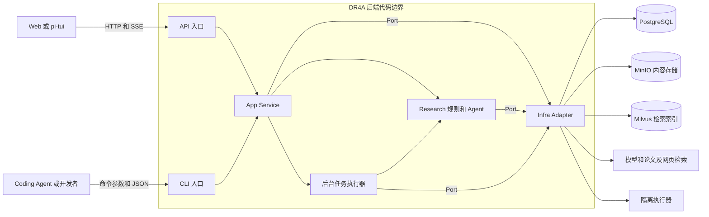
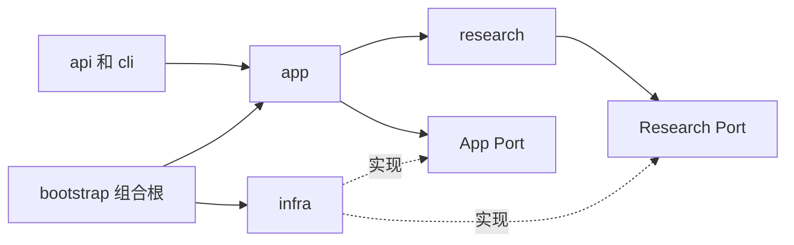

# DR4A 后端架构设计

> 设计版本：`mono-v1`，2026-10-05。状态：目标设计基线，供后续实现；不是现有代码能力声明。
> 五份 `docs/mono/` 文档共同定义后端。先读本文，再读数据模型、数据流、API、运行语义；不能只消费局部契约。

## 1. 范围、术语与设计权威

DR4A 为学术研究者提供一次研究决策的辅助报告：收敛请求、用户确认任务书、取证、校核、写作、审阅、交付。输出保留结论成立条件、原始出处和未解决风险，达到 `docs/cases/` 三份报告的组织粒度，而非泛泛综述。

V1 完整支持 `idea_exploration`、`method_differentiation`、`evaluation_design`。`reviewer_response` 是保留名称，当前无报告模块，所有入口明确拒绝。研究不替代真实科研实验；CodeCrafter 只对已获取数据做受控分析。

| 文档 | 唯一负责的设计维度 |
|---|---|
| [architecture.md](architecture.md) | 系统边界、职责、依赖、决策与迁移依据 |
| [data-model.md](data-model.md) | 字段类型、实体关系、枚举、数据库约束、版本身份 |
| [dataflow.md](dataflow.md) | 用例步骤、状态转换、阶段读写、事务顺序 |
| [api-contract.md](api-contract.md) | HTTP/SSE、CLI、Service、Port 的输入输出与错误映射 |
| [operations.md](operations.md) | 超时、预算、幂等、租约、恢复、降级、安全、部署和验收 |

项目章程仍是治理约束。原 `specs/` 的业务需求与验收目标继续有效；其旧实现方案，以及 `docs/contracts/`、`docs/architecture/` 中冲突的 HOW 设计由本基线替代。旧任务的 `[x]` 不证明本基线已经实现。修改必须检查五份文档影响面；不得在客户端 spec 中定义第二套服务端状态。

统一术语：

- **Session**：用户拥有的一次研究交互及整体生命周期；`status` 是会话状态。
- **Clarify**：请求收敛过程；`ask` 等待补充，`confirm` 等待明确确认。
- **ResearchBrief**：十字段任务书；草稿可改，冻结后只读。`brief_version` 是包装元数据。
- **Pipeline**：冻结后执行的流程；`phase` 是下一项待执行阶段，不能代替 `status`。
- **Agent**：无跨轮记忆的任务执行者，可以经 Port 调用工具；“纯工人”不等于没有 I/O。
- **Checkpoint**：已提交、可恢复的完整 PipelineState；事件或内存对象不是 Checkpoint。
- **Evidence**：有原文和来源定位的引用单元；检索摘要是候选，不自动成为主证据。
- **RetrievalResult**：中立的知识库命中；Research 负责转成 SourceRecord/Evidence。
- **Report**：已通过交付校验的不可变报告版本；Writer 草稿不是已发布 Report。

## 2. 系统边界与运行拓扑

Web/TUI 位于系统外，只消费公开契约。CLI 是后端第二入口，复用 App 与阶段函数；不通过内部调用来伪装客户端 E2E。fake 是开发测试能力，不能作为真实研究结果。

V1 一个 FastAPI worker，包含强引用任务注册表、后台调度扫描器、Pipeline/入库/删除任务和进程内 SSE 广播器。CLI 是独立进程；通过 PG 租约协调，不能依靠服务器内存锁。CPU/GPU 推理和解析用有界线程池或本地进程，不阻塞 ASGI 事件循环。

PG 保存任务接受状态，扫描器拉取可执行项；`asyncio.create_task` 只是加速触发，不是可靠队列。重启扫描持久任务。V1 不引入 Redis、LangGraph 或分布式任务平台，但仍需持久取消与租约。SSE 是瞬态广播，每个订阅者一份队列；断线不启动或恢复 Pipeline。

## 3. 模块与控制权

沿用草稿目标命名 `api / app / research / infra`。现有 `interface / application / domain/research / infrastructure` 是迁移映射；重命名不属于这次文档任务。实现可以先保留路径，但不能维护两套相同模块。

| 组件 | 职责与控制权 |
|---|---|
| API Router / DTO | 认证、参数校验、HTTP 翻译、SSE 编码；不决定阶段或直接调用 Adapter |
| CLI | 输入校验、显示、模式选择；调试前置拦截不替代生产校验 |
| AuthService | 注册、登录、密码校验、签发；用户通过 UserRepository 持久化 |
| ResearchService | 所有研究用例入口；协调 SessionService、Repository 和调度 |
| SessionService | Clarify 上下文、草稿版本、轮次、确认；调用 Architect/Machine，不调用 Orchestrator |
| Machine | 纯确定性政策：收敛判断、阶段转换、返工、停止；无 I/O |
| Orchestrator | 持有 PipelineState，切输入、执行阶段、验证合并、提交 Checkpoint、发布投影 |
| KnowledgeBaseManagementService | KB/Document 管理、删除屏障和恢复清理 |
| DocumentIngestionService | 上传、任务、重试、取消、租约、提交版本可见性 |
| DocumentIngestor | 单次解析/切片/Embedding/索引尝试；不自行发布 active |
| KnowledgeRetrievalService | 授权范围、可见版本、混合召回、正文读取、重排；不写研究事实 |
| TaskRunner | 调度、强引用、租约、shutdown；不计算研究结论 |
| EventBus | 广播提交状态与诊断进度；不是事实存储或控制总线 |
| Adapter | 外部协议转换与结构化失败；不伪造空成功或修改业务状态 |

| Agent | 输入任务 | 返回结果 |
|---|---|---|
| Architect.clarify | 草稿、来源选择、最新补充、待答问题 | ClarifyAssessment；无 status/freeze/next_phase |
| Architect.plan | 冻结 Brief、固定骨架 | SectionPlan；非空、覆盖规定章节与论断 |
| DeepScout | Brief、单章计划、已有证据、缺口、预算 | 来源/证据/论断关系/观察/覆盖 |
| DataAnalyst | 分析要求、Observation、原始 Evidence | 归一指标、比较集合、可比性原因 |
| CodeCrafter | AnalysisSpec、获准指标 | 受控 Artifact；不执行 LLM 自由代码 |
| Writer | 章节相关证据链、指标、Artifact、风险、返工目标 | 版本化草稿、绑定、任务专属结构 |
| Critic | 本次完整草稿及版本、绑定、原始证据链 | 对象级反馈、复核结果；不产路由动作 |

Agent 不修改共享 State、不存数据库、不启动其他阶段。Orchestrator 是研究 State 唯一写入者。代码校验与模型判断互补：ID 可解析不等于支持结论；语义审核不能绕过 Schema。

## 4. 依赖与 Port

组合根可以引用所有实现，用于配置、资源生命周期和注入。API/CLI 启动时使用组合根，业务函数只访问 Service。DTO 属于入口；Repository 属于 App；Research 不能反向导入 App Service。

| Port 所有者 | Port 与 Adapter |
|---|---|
| App | ResearchRepositoryPort / UnitOfWorkPort、UserRepositoryPort、KnowledgeBaseRepositoryPort、DocumentRepositoryPort、IngestionJobRepositoryPort → PostgreSQL |
| App | ContentStorePort → MinIO；DocumentParserPort → 本地 MinerU；EmbeddingPort → 本地 BGE-M3；VectorIndexPort → Milvus；RerankPort → 本地 BGE Reranker |
| App | EventBusPort → 进程内广播；TaskRunnerPort → 持久任务扫描 + asyncio；ClockPort → 可替换时钟 |
| Research | LLMPort → 结构化模型调用；SearchPort → arXiv/Bocha；FetchPort → 受限正文抓取；RetrievalPort → App RetrievalBridge；CodeExecutionPort → 隔离执行器 |

`RetrievalBridge` 是组合根注入 Research 的桥：实现只读 RetrievalPort，转调 KnowledgeRetrievalService，传递 owner 与授权版本范围。Research 只认识接口。Embedding/Vector/Content 属于 KB App，不重复定义两套底层 Port。

## 5. 数据与一致性边界

| 存储 | 内容与事实归属 |
|---|---|
| PG | 用户、所有权、Session、消息、Brief、Run、取消、租约、Checkpoint、Report、KB 元数据/Job、调用缓存 |
| 应用 MinIO | 不可变原始文件、解析结果、Chunk 正文、取证缓存、附件；PG 保存键和 SHA-256 |
| Milvus Standalone | 可重建 dense+sparse 索引与过滤元数据；不决定可见性 |
| 内存 | 工作中的 State、缓存、锁、任务引用、订阅队列；不是唯一持久副本 |

PG 内跨 Repository 变更在同一事务完成。PG 与 MinIO/Milvus 无分布式事务，使用不可变对象、稳定 ID、staging 版本、状态屏障、恢复清理。先提交再发布成功事件。报告、最终 Checkpoint、Run 和 Session 完成状态在一个 PG 事务发布。

一个 Session V1 只冻结一份 Brief、拥有一个 Run。修改冻结内容需新 Session；恢复不能改 Brief。领取执行增加 Run.attempt_count；Checkpoint.seq 单调，不能按阶段名称倒序寻找“最新”。

## 6. 收敛决定与现有证据

以下是补齐或改变旧方案的决定，不是现有能力声明。

| 冲突或缺口 | 本基线决定 | 仓库证据 |
|---|---|---|
| 创建 ask，查询 clarify | 统一 SessionStatus；clarify 仅过程名 | research-api §4/§6 |
| 达轮数上限 ready | 关键缺口仍 ask；不得替用户确认 | session_service 与 FR-004 |
| SessionService spawn | ResearchService 协调冻结和 Run 事务 | 001 plan 边界说明与示例 |
| 取消内存、SSE 重连恢复 | 取消持久；显式 resume；SSE 无副作用 | 001 plan/research |
| 按 phase 优先级恢复 | Run + seq + next-phase Checkpoint | research_service.get_status |
| arXiv 自动 peer_reviewed，snippet 证据 | 来源等级核实，关键引用读原文 | agents/scout.py |
| 全局比较，未知字段相等 | ComparisonSet；未知阻断 compatible | agents/data_analyst.py |
| title+sections 算报告 | 固定 0–5 + References、任务模块、绑定/风险/质量 | writer.py 与 cases |
| 达返工上限 done | 收缩后复核，区分运行与质量 | orchestrator._advance |
| KB 内存进度、只删登记 | PG Job + 内容版本 + 完整删除 | knowledge_base_service.py |
| collection/partition 混用 | 一套 collection schema、每 KB partition | milvus.py 注释与实现 |
| sparse/BM25 混称 | BGE-M3 learned sparse + dense | 旧 mono 与 research.md |
| 用户内存、未传 owner | PG 用户；每用例 owner 校验 | bootstrap/router |
| reviewer 未细化仍接受 | 422 unsupported_task_type | spec 与 report-skeleton |

目标 hybrid 能力依据 [Milvus 2.6 文档](https://milvus.io/docs/v2.6.x/hybrid_search_with_milvus.md)，模型输出依据 [BGE-M3 文档](https://bge-model.com/bge/bge_m3.html)。这些不证明仓库接通；Adapter 版本与形状须真实测试固定。

## 7. 实现交接与限制

顺序：枚举与校验 → PG 事务/版本/归属 → Clarify/确认 → Run/SSE → 正文证据 → 比较/写作/审核 → KB 闭环 → 故障恢复/部署验收。验收见 operations，fake 不证明真实 E2E。

可复用五阶段函数、对象名称、Port/fake、API/CLI 骨架、Compose。需要补齐 parser/content 存根、真正 hybrid、持久用户/Job、确认端点、快照事务、版本绑定、报告 serializer。TUI 后续按本 API 增补版本和幂等参数，不能迁就旧客户端而降级设计。

V1 不含复杂 RBAC、共享 KB、共同编辑、事件回放、任意代码、自动科研实验、reviewer_response、评测平台。`07-evaluation.md` 是评测参考；案例有归因错误评注，复用其结构与任务维度，不能照抄其全部事实。
