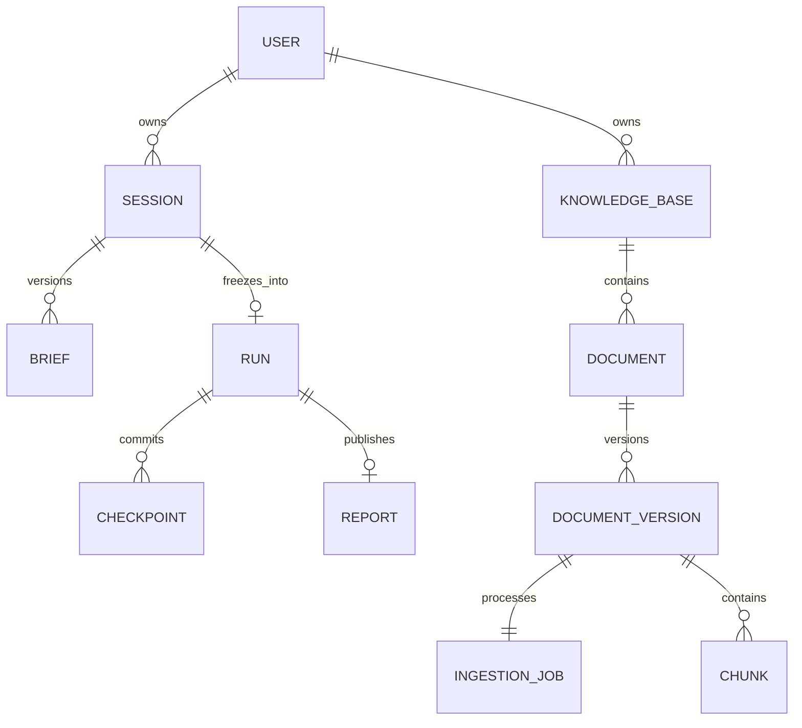

# DR4A 后端数据模型设计

> `mono-v1` 目标基线。本文是字段、枚举、身份与存储约束来源；流程见 [dataflow](dataflow.md)，接口见 [API](api-contract.md)，恢复见 [operations](operations.md)。

## 1. 类型与身份约定

JSON 使用 snake_case；时间为 UTC RFC3339，PG 为 timestamptz。资源 ID 是 UUID 字符串，内部来源/证据等稳定 ID 是前缀加 SHA-256。字典键必须等于对象 ID。所有对象包含明确 Schema，未知字段拒绝；快照带 schema_version。可扩展 JSON 仅限 metadata、context/evaluation_context、Claim.conditions、Observation.row_key/column_key、Failure.details；它们只存研究属性或诊断，不得含控制指令。其值限定 JSON 标量或标量列表，键为非空 string；其余 object 按本文指定 Schema。未知事实用 null，不用空值伪装已知。

公共 string 默认 trim 后非空；列表去重且顺序稳定；有限 number 不允许 NaN/Infinity。数值观察保留十进制字符串，计算用 Decimal，避免丢精度。版本与 seq 从 1 起；轮次从 0 起；attempt_count 从 0 起，在取得执行租约时加 1。以下 `?` 表示可空；未标可空者必填。

### 1.1 控制枚举

| 类型 | 唯一合法值 |
|---|---|
| TaskType（V1） | idea_exploration、method_differentiation、evaluation_design |
| SessionStatus | ask、confirm、ready、running、cancelling、completed、failed、cancelled |
| ResearchPhase | plan、research、analyze、write、review、done |
| RunStatus | ready、running、cancelling、completed、failed、cancelled |
| ReviewVerdict | approved、approved_with_risks、needs_more_work |
| KnowledgeBaseStatus | creating、active、deleting、deleted |
| DocumentStatus | active、deleting、deleted |
| DocumentVersionStatus | staging、active、failed、retired |
| IngestionJobStatus | accepted、processing、cancelling、completed、failed、cancelled |
| ClaimStatus | open、supported、limited、refuted、insufficient |
| EvidenceRelation | supports、refutes、limits |
| Comparability | compatible、partial、incompatible |
| ArtifactStatus | completed、failed、skipped |
| IssueType | missing_source、comparability_violation、overclaim、logic_error、hallucination、outdated |
| Severity | critical、major、minor |
| DataClassification | public、private |

`clarify` 不是 status；`done` 只属于 phase；`completed` 不是 phase。`ready` 是已冻结、等待执行的持久状态；202 ready 的响应不保证客户端下一次 GET 仍看到 ready。

## 2. 用户与研究会话

### 2.1 User、SessionState、Message

| 对象 | 字段及约束 |
|---|---|
| User | user_id: UUID；email: string 唯一（trim+lower），3–254；password_hash: string?（开发用户可空，不能登录）；is_development: bool；created_at |
| SessionState | session_id、owner_id；query: string；status: SessionStatus；revision: int；brief_draft: Partial ResearchBrief；brief_version: int；pending_questions: string[]；missing_fields: BriefField[]；clarification_round: int；clarification_limit_reached: bool；source_selection: SourceSelection；run_id: UUID?；failure: Failure?；created_at、updated_at |
| Message | message_id: UUID；session_id；sequence: int；role: user/assistant/system；kind: initial/answer/assessment/confirmation/rejection；content: string；assessment: ClarifyAssessment?；brief_version: int；created_at |

Session.owner_id 必须关联 User；开发身份也创建固定 UUID 用户，禁止 NULL 所有权。`revision` 每次持久状态变更加 1，用于 CAS。`brief_version` 每次成功初始/回答/退回处理加 1，包括无字段变化的已处理请求；Run 更新不改它。Message 追加不可改，唯一 (session_id, sequence)。SessionState 是“当前”压缩态，历史在 messages，不重复把无限历史塞进 prompt。

### 2.2 ResearchBrief 与 SourceSelection

ResearchBrief 恰好十个字段，所有字段为 string，避免目前示例的 string/list 混用：

| 字段 | 类型与规则 |
|---|---|
| task_type | TaskType |
| decision_goal | 非空 string，研究决策，不能默认“随便研究” |
| research_object | 非空 string，任务对象和输入输出 |
| scope | 非空 string，时间/领域/数据/资源/排除范围 |
| comparison_scope | 非空 string；不比较时明确写“无直接比较：原因”，不能缺字段 |
| claims_to_verify | 非空 string；候选假设或需核实维度，不要求用户先写确定结论 |
| evidence_requirements | 非空 string，可接受来源/协议/原文要求 |
| conclusion_boundary | 非空 string，可支持与不能外推的边界 |
| deliverable | 非空 string，报告及专属交付 |
| assumptions | string；无默认假设时空字符串合法，有默认时逐条披露 |

除 task_type 外各字段最多 8000 字符；draft 是上述字段子集，不能混入 query 或运行参数。模型返回 task_type 必须映射到闭集后再校验，不能用中文标签作为内部值。`reviewer_response` 返回 unsupported_task_type。

`SourceSelection = {categories: SourceCategory[], knowledge_base_ids: UUID[]}`。SourceCategory = papers/web/knowledge_base；categories 至少一项，默认 papers+web；knowledge_base 选中时 IDs 非空，否则 IDs 必须为空。原 query 的来源建议与此对象独立于十字段 Brief；确认时一并锁定。sources 不允许把类别和任意 KB 名混放一个列表。

`BriefRecord = {session_id, version, content: ResearchBrief|Partial, frozen_at?, confirmed_by?, content_hash?, source_selection}`；唯一 (session_id,version)，Session 指向最新版。只有 confirm 可以写 frozen_at；冻结版本全字段校验、规范 JSON SHA-256；内容和来源选择不可变，不能用 save_brief 覆盖冻结记录。

`ClarifyAssessment = {missing_fields: BriefField[], questions: string[0..2], brief_patch: Partial ResearchBrief, assumptions: string[], field_reasons: map<BriefField,string>}`。field_reasons 说明何种缺口会影响检索/证据/结论/验证；只有判断，无 status。代码重新检查十字段，模型说“无缺口”不能使缺字段通过。确认候选可以含明确保守默认，但关键决策/对象/交付/任务类型不允许编造。

## 3. Run、Checkpoint 与 PipelineState

### 3.1 执行身份与恢复字段

| 对象 | 字段 |
|---|---|
| ResearchRun | run_id、session_id（唯一）、brief_version、brief_hash；status；phase；attempt_count；checkpoint_seq；cancel_requested_at?；lease_owner?、lease_token: int、lease_expires_at?；resume_allowed: bool；failure?；config_snapshot: RunConfig；created_at、started_at?、finished_at? |
| Checkpoint | snapshot_id: UUID；run_id；seq: int；schema_version: 1；phase；state: PipelineState；state_hash；created_at |
| ToolCallRecord | call_id: string；run_id；call_key: string；status: reserved/succeeded/failed/uncertain；request_hash；result_object_key?；result_hash?；failure?；budget_units: int；created_at、updated_at |

Checkpoint 唯一 (run_id,seq)，在一次事务内更新 Run.checkpoint_seq、Run.phase 和 Session.status。最新 = Run.checkpoint_seq 指向的完整快照；不是按 phase 顺序或单靠 timestamp。phase 是下一待执行阶段，正在执行中持久 phase 不提前更改。Run 完成时 phase=done。

ToolCallRecord 唯一 (run_id,call_key)，用于同一语义输入的搜索/抓取/LLM/分析去重；失败和不确定调用的恢复政策见 operations。缓存结果也可能是合法空结果，不与异常合并。

### 3.2 PipelineState 完整顶层

| 字段 | 类型 |
|---|---|
| schema_version、session_id、run_id、brief_version、brief_hash | int=1、UUID、UUID、int、SHA-256 |
| phase | ResearchPhase |
| research_brief、source_selection | 冻结 ResearchBrief、SourceSelection（只读） |
| section_plans | SectionPlan[] |
| sources、evidence、claims | map<ID, SourceRecord/Evidence/Claim> |
| claim_evidence_links | ClaimEvidenceLink[]（三元组唯一） |
| quantitative_observations、comparable_metrics、comparison_sets | map<ID, QuantitativeObservation/ComparableMetric/ComparisonSet> |
| analysis_artifacts、section_coverage | map<ID, AnalysisArtifact/SectionCoverage> |
| draft_sections | map<section_id,DraftSection> |
| draft_claim_bindings | DraftClaimBinding[] |
| critic_feedback | CriticFeedback[]（保留历次问题） |
| draft_version、reviewed_draft_version | int（初始 0）、int? |
| review_verdict | ReviewVerdict? |
| final_report | FinalReport?（仅交付事务写入） |
| run_metadata | RunMetadata |
| errors | Failure[] |

初始非输入列表/map 全为空、final_report=null。`RunMetadata = {config: RunConfig, budget_used: BudgetUsage, rework_count: int, rework_targets: ReworkTarget[], degraded_sources: Degradation[], unit_manifest: map<string,UnitResult>, knowledge_snapshot: VersionReference[], stop_reason?: string}`。unit_manifest 记录已提交章节/查询/写作单元，只有带有效结果 hash 的单元可跳过。

`RunConfig` 固定模型/提示词/模板/解析/Embedding/index 版本、source policy、操作超时、预算和并发（具体默认见 operations）。`BudgetUsage` 含 llm_calls/search_calls/fetch_calls/tokens/elapsed_s。恢复不重置预算。VersionReference = {kb_id,document_id,document_version_id,index_version}，在冻结事务保存当时可见版本；恢复不静默换新文档。

RunConfig 的必填结构：`{versions: {llm_provider, llm_model, llm_revision, prompt_versions: map<agent_method,string>, template_versions: map<Operation,string>, parser_version, chunker_version, embedding_version, reranker_version, index_version}, source_policy: {categories: SourceCategory[], knowledge_base_ids: UUID[], private_only: bool}, limits: {deadline_s, search_calls, fetch_calls, llm_calls, tokens, terminal_reserved_calls, terminal_reserved_tokens, rework_rounds, citation_depth, gap_queries_per_spec}, timeouts_s: {llm, search, fetch, embedding, rerank, vector, content, parser, sandbox}, concurrency: {search, fetch, llm, local_inference}}`。版本值为锁定标识字符串；limits/timeouts/concurrency 为正整数（rework_rounds 可为 0）。全局容量与租约参数属于进程 Settings，不随单 Run 自由覆盖。密钥、token 和包含密码的 URL 不得进入快照。

`UnitResult = {unit_id:string, phase:ResearchPhase, input_hash:SHA-256, result_hash:SHA-256, result_ref:ContentRef, checkpoint_seq:int, completed_at:timestamp, affected_ids:string[]}`；`ContentRef = {key:string, sha256:SHA-256, size:int, media_type:string}`。结果对象在 MinIO 的 `phase-results/<run_id>/<hash>`，保存版本化 envelope（可信单元范围、PhaseInput 的 input_hash、PhaseResult），不重复存完整输入事实；result_hash 等于对象内容 hash，不是仅有任意合法格式的字符串。先写/校验不可变对象，再在单元 Checkpoint 事务保存引用及合并成果。恢复跳过前须验证对象 hash/输入身份、该单元前后的已提交快照及作用范围；对象缺失/损坏明确失败，不重新执行已提交单元。未提交对象可成为待清理 orphan，不表示单元已经成功。`AuthorizedKnowledgeScope = {owner_id:UUID, run_id:UUID, versions:VersionReference[], data_classification:DataClassification}`，由 Service 根据冻结范围构造，不接受模型或公网请求直接传入。

## 4. 研究事实与派生产物

以下对象在 Checkpoint JSONB 中整体保存；字段是实现 Schema，不是自由 dict。

### 4.1 计划、来源与证据

| 对象 | 字段及类型 |
|---|---|
| SectionPlan | section_id: 固定 section_1..section_5；title、objective: string；claim_specs: ClaimSpec[]；sub_questions、retrieval_anchors、evidence_requirements: string[]；analysis_requirements: AnalysisRequirement[] |
| ClaimSpec | spec_id: string；text: string；required_conditions: string[]；required_source_tiers: SourceTier[] |
| AnalysisRequirement | requirement_id: string；operation: Operation；claim_spec_ids: string[]；required_context_fields: string[]；parameters: object（按 operation Schema 校验） |
| SourceRecord | source_id: string；source_type: paper/web/dataset/code/standard/local_document；title: string；authors_or_publisher: string[]；published_at: string?；version: string?；canonical_url: string?；provenance: Provenance[]；source_tier: primary/official/peer_reviewed/secondary/unknown；content_object_key: string?；content_hash: string?；data_classification |
| Provenance | retrieved_at: timestamp；retrieved_via: papers/web/knowledge_base/citation_trace/gap_fill；original_ref: string；document_version_id: UUID?；upstream_source_id: string? |
| Evidence | evidence_id、source_id；evidence_type: method/protocol/result_table/limitation/dataset_description/code_configuration/standard_clause/other；location: Location；quote_or_raw_content: string；extraction_method: string；content_hash: SHA-256 |
| Location | page_start、page_end: int?；section、table、file、commit、selector: string?；line_start、line_end: int?；chunk_id: string? |

SectionPlan 必须恰好覆盖 section_1..section_5；0 和 References 由 serializer 生成。每章 objective 非空；需取证的章 sub_questions 非空；纯建议/风险章可引用其他章 ClaimSpec，不能伪造搜索需求。整个 plan 至少有一个 ClaimSpec 和一个检索问题，覆盖 Brief 所有研究维度。

Source ID 按 DOI + 版本、arXiv + 版本、规范 URL + 内容 hash、repo + commit、或 KB DocumentVersion 生成；相同论文多入口在身份确认后合并 provenance；不能按域名计独立来源。arXiv/预印本不自动 peer_reviewed。Location 至少一个有效定位；web 可用 selector/标题与段落行号；snippet 不是关键技术论断的合格原文定位。Evidence 的原文必须来自实际 Fetch/Parser/RetrievalResult 并通过摘录范围校验。

### 4.2 Claim、覆盖、观察

| 对象 | 字段及类型 |
|---|---|
| Claim | claim_id；spec_ids: string[]；text: string；claim_type: factual/empirical_comparison/hypothesis/recommendation；conditions: object；status: ClaimStatus；status_reason: string |
| ClaimEvidenceLink | claim_id、evidence_id；relation: EvidenceRelation；rationale: string |
| Gap | gap_id、section_id；claim_spec_id: string?；claim_id: string?；reason: string；fillable: bool；verification_action: string |
| SectionCoverage | section_id；claim_spec_ids、claim_ids、evidence_ids、covered_claim_ids: string[]；gaps: Gap[]；unresolved_items: string[] |
| QuantitativeObservation | observation_id、evidence_id；kind: benchmark_result/dataset_stat/hyperparameter/resource_cost；row_key、column_key: object；raw_value: string；value: decimal string?；uncertainty: decimal string?；statistic: string；context: object；unit: string? |

Claim ID 由规范化主语/关系/对象/conditions 生成，不能只 hash 文本；条件变更生成新 Claim，不覆盖旧论断。支持和反驳并存时 limited 并说明冲突；无合格关系为 insufficient，不凭模型确定性决定 supported。假设/建议必须标类型，不能伪装已有实验结论。未检索到的 ClaimSpec 也产生 Gap，不以“模型没有抽出 Claim”消除缺口。

Evidence ID = hash(source_id + canonical Location + normalized quote)。多源证据保留；关系三元组去重。Observation ID = hash(evidence_id+row_key+column_key)，保留完整表头/单位/脚注上下文。

### 4.3 可比性与执行

| 对象 | 字段及类型 |
|---|---|
| ComparableMetric | comparable_metric_id；observation_ids: 非空 string[]；metric_definition、evaluated_method: string；evaluation_context: object；value: decimal string?；unit: string?；normalization_basis: string；missing_context_fields: string[] |
| ComparisonSet | comparison_set_id、section_id、requirement_id；metric_ids: string[]；required_context_fields: string[]；comparability: Comparability；reasons: 非空 string[] |
| AnalysisSpec | section_id、requirement_id、comparison_set_id；operation: Operation；metric_ids: string[]；parameters: object；template_version: string |
| AnalysisArtifact | artifact_id、section_id；input_metric_ids、input_evidence_ids: string[]；comparison_set_id；operation；code_or_recipe: string；template_version；output: object；object_keys: string[]；execution_status: ArtifactStatus；failure: Failure? |

Operation 闭集 = comparison_matrix/pairwise_delta/plot/statistic/aggregation，图类型是 plot.parameters 中的枚举，不是另一个 operation。Artifact ID 包含输入 hash、章节、模板、参数，不能仅 hash 模板名。

以下为 AnalysisRequirement/AnalysisSpec.parameters 的判别 Schema；未列字段拒绝。需求中的指标引用使用 claim_spec_ids 与条件选择器，DataAnalyst 解析后写 AnalysisSpec.metric_ids；执行阶段的所有引用必须在该组 metric_ids 内。

其中 pairwise_delta 的计划态参数为 `{left_claim_spec_id,right_claim_spec_id,mode}`，两个 ID 必须在该需求 claim_spec_ids 中；分析后确定唯一指标，替换为下表的 metric ID 参数。若一个 Spec 对应多个指标，按同协议/方法/条件分组生成多个 AnalysisSpec，无法唯一配对则 Gap，不猜配对。其余操作在计划态和执行态参数相同。

| operation | parameters 与确定性输出 |
|---|---|
| comparison_matrix | `{columns:string[]}`，列名只能取 metric_definition/evaluated_method/value/unit 及 required_context_fields；输出 `{columns,rows:[{metric_id,cells:map<string,string|null>} ]}`，缺项显式 null，不计算排名 |
| pairwise_delta | `{left_metric_id:string,right_metric_id:string,mode:"absolute"\|"relative_percent"}`；输出 `{left_metric_id,right_metric_id,value:decimal string,unit:string}`；计算 left-right，百分比为 100×(left-right)/abs(right)，分母零拒绝；不自动解释越大越好 |
| plot | `{kind:"bar"\|"line",x_field:string,y_field:"value",include_uncertainty:bool}`；x_field 为 evaluated_method 或已知 context 字段；line 要求有序数值 x；输出 `{points:[{metric_id,x:string,y:decimal string,uncertainty:decimal string|null}],files:string[]}`；误差仅用原文同口径已报告值，禁止估计 |
| statistic | `{kind:"mean"\|"median"\|"min"\|"max",group_by:string[]}`；仅同方法、同定义/单位、同协议的独立重复实验值允许聚合；输出 `{groups:[{key:map<string,string>,metric_ids:string[],count:int,value:decimal string,unit:string}]}`；无原始样本不计算显著性/p值 |
| aggregation | `{kind:"count",group_by:string[]}`；仅计数已知条件分组中的获准指标，输出 `{groups:[{key:map<string,string>,metric_ids:string[],count:int}]}`，不得把研究数量解释为证据可信度 |

group_by 只能取同组已知 evaluation_context 字段；statistic 与 aggregation 的空数组表示整组。pairwise/statistic/plot 的 value 必须非空且单位一致；不满足操作前置生成 skipped Artifact 与具体 Gap，不用零填充。模板输出 JSON 必须通过上表校验，files 仅为执行器产生且检查通过的附件 basename；持久 object_keys 由 App 生成。未知参数或任意 Python 字符串不得交给沙箱。

**可比性属于 ComparisonSet，不属于孤立 Metric。** 这是对旧 schema 的明确修正：一个指标可对某组 compatible、对另一组 incompatible。required_context_fields 至少 task/dataset_and_version/split_or_protocol/metric_definition/unit；按主张追加 threshold_or_budget/label_rate/baseline/statistic 等。缺字段（两个 null 也算缺）不能 compatible；同名指标不同定义不能直接比较。CodeCrafter 只接受 compatible 集合；partial/incompatible 可写条件对照，但不得算优劣排名。

### 4.4 草稿、审阅与报告

| 对象 | 字段及类型 |
|---|---|
| DraftSection | section_id、title、content: string；draft_version: int；statements: Statement[]；task_payload: TaskPayload? |
| Statement | statement_id、text；kind: factual/hypothesis/recommendation/limitation |
| DraftClaimBinding | draft_version、section_id、statement_id；claim_ids、cited_evidence_ids、artifact_ids: string[] |
| CriticFeedback | issue_id；draft_version；target_type: source/evidence/claim/metric/comparison_set/artifact/draft_section/statement；target_id；section_id；issue_type；severity；fillable: bool；description；resolved: bool；resolution: string?；resolved_in_version: int? |
| ReworkTarget | issue_ids、section_ids、claim_ids: string[]；action: re_research/re_analyze/revise/acknowledge_limit；reason: string |
| FinalReport | report_id、session_id、run_id；version: int；brief_version；draft_version；review_verdict；title、markdown；sections: map<section_id,DraftSection>；bindings: DraftClaimBinding[]；references: Reference[]；risks: RiskItem[]；created_at |
| Reference | reference_id、source_id；title；canonical_url: string?；version: string?；locations: Location[]；evidence_ids: string[] |
| RiskItem | risk_id；description、evidence_status、impact、verification_action；claim_ids、issue_ids: string[] |

statement_id 必须能定位实际文本；事实结论绑定非空证据，建议/假设须明确标记，并绑定其依据或 RiskItem。修订全局 draft_version 加 1，保留未改章节内容与绑定但统一更新版本；审核只针对这个版本。旧反馈保留，只有复核后 resolved=true；问题 ID 包含对象、类型和语义缺陷，不能同目标所有问题共用一个 ID。

TaskPayload 是判别联合，由 `task_type` 判别：idea_exploration={candidate_questions:[{question,hypothesis,resources,novelty_risk,feasibility}],recommendation,minimal_validation}；method_differentiation={comparison_rows:[{work,input_representation,mechanism,output,solved_limits,open_problems}],differential_claims,contribution_boundary}；evaluation_design={protocol_rows:[{claim_id,protocol,controls,metrics,supported_conclusions,unsupported_conclusions}],failure_modes}。除 ID 外单元字段为非空 string，controls/metrics/differential_claims/failure_modes 为非空 string[]。数组非空，候选数按 Brief 的明确要求校验；结构字段由代码渲染第 3 节，行内事实同样有 Statement/Binding。每行附 statement_ids: string[]，定位该行关键断言。纯文本“提到协议”不能替代必要交付。

Report 的运行成功与 review_verdict 分离；needs_more_work 也可交付一份结构完整、已移除无证据事实、明确风险的辅助草稿，不能标 approved。references 来自真正引用的 Sources，不由 LLM 生成书目。

### 4.5 确定性报告 serializer

序列化顺序固定，不靠模型自由选择标题。title 不为空；section_1..5 内容不为空，缺证据也要写明缺口；section_0 从冻结 Brief 投影，References 从真实引用生成。顶层附 review_verdict 和未闭环说明，不增加伪造实验结论。报告必须包含：

| 顶层章节 | 必需内容或子节 |
|---|---|
| 0. Research Brief | 类型、决策、对象与范围、结论边界、关键假设；完整 Brief 仍可从 SessionView 取得 |
| 1. 问题定义与研究边界 | 1.1目标问题；1.2系统/数据/应用或威胁边界；1.3不回答的问题 |
| 2. 证据基础与关键发现 | 2.1检索范围与信源标准；2.2已确认事实；2.3论断与证据缺口 |
| 3. 任务专属核心分析 | 根据下面的 TaskType 展开 |
| 4. 可支持的结论与建议 | 4.1有证据结论；4.2适用前提与残余风险；4.3下一步行动 |
| 5. 待验证风险清单 | 风险/未知项、证据状态、影响、验证方式，来自 RiskItem；无风险时明确说明 |
| References | 编号、真实title/version/link/location；空证据报告写“无可核验引用”，不填假文献 |

idea_exploration 第3节=“候选研究问题与可行性评估”，含已有工作/缺口、候选问题卡表、推荐问题/最小验证；method_differentiation=“技术路线与方法差分论证”，含机制、最近邻矩阵、可验证差分论断、贡献边界/相似性风险；evaluation_design=“验证方案设计”，含论断、数据/切分/基线、协议—指标—结论映射表、失败模式/补实验。表列分别使用 TaskPayload 的字段，不允许省略不能支持的结论。

每个 Statement 在输出含稳定 HTML anchor（例如 `statement-st_123`），引用以 `[R1，p.7/Table 4]` 等可读形式渲染，另保留机器绑定。程序检查草稿事实句/表行都有 Statement，且所有事实 Statement 有 Claim 和合格 Evidence；不能让未登记正文绕过审核。引用位置来自 Evidence，书目编号由 Source 排序确定。风险/建议不可用无证据事实来填充；合成研究缺口应标“在本次检索范围内未发现”，而非断言全世界不存在。

正文装配以 statements 与 task_payload 为源：自由 content 只能是同一内容的渲染投影，不接受未登记的额外实质段落；标题/结构标记由模板生成。每个实质段落或表行须定位到 statement_ids，代码校验文本覆盖和 ID/绑定完整性。factual 与 hypothesis/recommendation 的语义分类、证据是否真的支持文本仍由 Critic 复核；不宣称字符串覆盖检查能证明事实为真。校验前先 escape 不受信 HTML，只有 serializer 自行生成 anchor；不允许资料或模型注入脚本/任意链接协议。

## 5. 知识库实体与索引

| 对象 | 字段及约束 |
|---|---|
| KnowledgeBase | kb_id、owner_id；name: 1–100，owner 内唯一；description: string? ≤2000；data_classification（默认 private）；status；revision；index_version；cleanup_cursor: string?；failure?；lease_owner?、lease_token、lease_expires_at?；created_at、updated_at |
| Document | document_id、kb_id；filename: string（展示名，非路径）；media_type: application/pdf；status；active_version_id: UUID?；revision；cleanup_cursor?；failure?；lease_owner?、lease_token、lease_expires_at?；created_at、updated_at |
| DocumentVersion | document_version_id、document_id、kb_id；content_hash；ingestion_version: string；index_version: string；source_object_key；parsed_object_key: string?；manifest_object_key: string?；chunk_count: int ≥0；status；created_at、activated_at? |
| IngestionJob | job_id、document_version_id；idempotency_key；status；attempt_count；attempt_history: JobAttempt[]；progress: IngestionProgress；cancel_requested_at?；lease_owner?、lease_token、lease_expires_at?；failure?；created_at、started_at?、finished_at? |
| JobAttempt | attempt: int；started_at、finished_at?；status: processing/completed/failed/cancelled；failure: Failure?；progress: IngestionProgress |
| IngestionProgress | step: upload/parse/chunk/embed/index/commit/cleanup；completed_units: int；total_units: int?；completed_batches: string[] |
| Chunk | chunk_id: string；kb_id、document_id、document_version_id；ordinal: int；chunk_type: text/table/formula；content_object_key、content_hash；embedding_anchor: string；location: Location；metadata: object |
| RetrievalResult | kb_id、document_id、document_version_id、chunk_id；content: string；score: number；location；source_metadata: object；retrieval_trace: object |

RetrievalResult.content 是非空 string，score 为有限 number。`source_metadata = {title:string,filename:string,year:int|null,data_classification:DataClassification,content_hash:SHA-256}`；`retrieval_trace = {dense_rank:int|null,sparse_rank:int|null,fused_score:number,rerank_score:number|null,index_version:string,degraded:bool}`。`VectorHit = {chunk_id:string,dense_rank:int|null,sparse_rank:int|null,fused_score:number}`；`RankedHit = {chunk_id:string,score:number}`。Adapter 结果的所有 chunk_id 都须在授权候选集合中，缺失或额外 ID 为 index_not_ready/model_output_invalid，不允许补造。

Document 初始 active 但 active_version_id=null 时可管理不可检索。一个 Document 只有一个 active 版本；新 staging 不覆盖旧 active。completed Job 的版本**曾成功提交**，后来可 retired；不能要求所有历史 completed 永远 active。failed/cancelled Job 的新版本不可见。

唯一内容身份 (kb_id,content_hash,ingestion_version)，ingestion_version 包括 parser/chunker/embedding/index profile hash。重复内容返回已有 version/job；显式 document_id 与已有内容归属冲突返回 409，不能复制版本到另一 Document。一个 Document 同时最多一个 accepted/processing/cancelling Job；重试沿用同 Job/Version，稳定 chunk_id = hash(version_id+parser/chunker version+ordinal+content_hash)。

MinIO 键使用 owner/KB/version 前缀，由服务生成；PG 存 Chunk 到 object_key 的映射。Milvus 使用 `dr4a_chunks_v1` collection、`kb_<uuid_without_hyphens>` partition；同一 index_version 的 schema 固定：chunk_id VARCHAR 主键 auto_id=false，kb_id/document_id/document_version_id/index_version、chunk_type、page_start/year（可空字段由 Adapter 明确编码），dense_vector float[1024]、sparse_vector sparse<int,float>。动态字段关闭；正文唯一副本在 MinIO。BM25 不属于该 profile。

## 6. PostgreSQL 表与约束

沿用单 public schema，避免旧文档多 schema 与现有 DDL 双轨。ID UUID（内部稳定 hash 为 text）；外键索引；metadata、完整 State 与正文结构用 JSONB；时间用 timestamptz。

| 表 | 主键、外键与必需约束 |
|---|---|
| users | user_id PK；email UNIQUE；开发用户无密码不可登录 |
| sessions | session_id PK；owner_id FK NOT NULL；revision；run_id?；status CHECK；clarify 压缩态 JSONB |
| messages | message_id PK；session_id FK；UNIQUE(session_id,sequence) |
| briefs | PK(session_id,version)；content JSONB；冻结内容不可更新 |
| research_runs | run_id PK；session_id UNIQUE FK；(session_id,brief_version) FK briefs；租约、phase、seq、cancel 与配置 |
| phase_snapshots | snapshot_id PK；run_id FK；UNIQUE(run_id,seq)；state JSONB；schema_version、hash |
| reports | report_id PK；run_id FK；UNIQUE(session_id,version)；V1 每 Run 一个发布报告；content JSONB |
| tool_calls | call_id PK；run_id FK；UNIQUE(run_id,call_key) |
| knowledge_bases | kb_id PK；owner_id FK；UNIQUE(owner_id,name)（deleted 后允许重用，partial unique） |
| documents | document_id PK；kb_id FK；active_version_id?；status/lease |
| document_versions | document_version_id PK；document_id/kb_id FK 且归属匹配；UNIQUE(kb_id,content_hash,ingestion_version)；partial UNIQUE(document_id) WHERE status=active |
| ingestion_jobs | job_id PK；document_version_id UNIQUE FK；部分唯一索引限制同 Document 有一个活动 Job（用 document_id 冗余列与复合 FK 保证归属一致） |
| chunks | chunk_id PK；document_version_id FK；UNIQUE(document_version_id,ordinal)；object_key/hash/location |
| idempotency_requests | PK(owner_id,operation,key)；request_hash；state: in_progress/completed；lease_expires_at；response_status/response_body?；resource_id? |

idempotency_requests 完成记录至少保留 7 天；其资源内容去重身份不随记录到期消失。所有权查询用 WHERE owner_id，跨资源验证父子归属。更新状态须 expected_revision 与租约 token；受影响行数为 0 = stale 写入失败。局部锁不是一致性证明。Check/Unique 不满足需翻译领域错误，不直接暴露 SQL。

不对用户成果物做级联物理删除；KB/document 删除是逻辑屏障和外部清理，保留 Job/版本/审计元数据。快照与 Report 保存实际引用摘录；资料被删除后不得回源取新版本来改写旧结论。

## 7. 关系与完整性门

每次阶段提交校验：所有引用 ID 存在；Source/Evidence/Observation/Metric/Artifact 回链闭合；section 与 spec 归属合法；冻结 hash 未变；draft 与绑定同版；预算非负且未越界。审核、Report 另查全部要求章节、Statement 覆盖、任务专属字段、引用书目、风险与 unresolved issues 的对应。失败不能吞成空字典或空计划。
