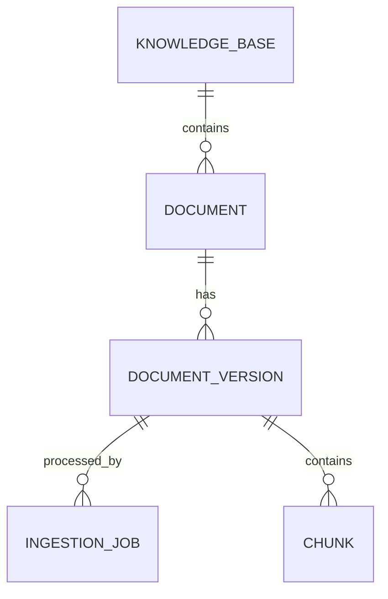

# DR4A 后端数据模型设计

> 状态：编写中。本文只记录知识库三个 App Service 需要的初步数据模型。其他部分仍是骨架。本文不是当前权威设计来源。

## 1. 文档范围与建模规则

本文定义实体、值对象、字段、关系和不变量。本文不定义用例步骤、接口路径或重试政策。

PostgreSQL 保存知识库生命周期的事实。MinIO 保存原始文件、解析结果和 Chunk 正文。Milvus 保存可重建的检索索引。

## 2. Research 数据模型

> 待编写。本节将记录 ResearchBrief、SessionState、PipelineState、Evidence 和 Report。

## 3. 知识库数据模型

### 3.1 KnowledgeBase

| 字段 | 类型 | 约束 |
|---|---|---|
| `kb_id` | UUID | 主键，不可变 |
| `owner_id` | UUID | 必填 |
| `name` | string | 对同一所有者必须唯一 |
| `description` | string 或 null | 可选 |
| `status` | enum | `creating`、`active`、`deleting`、`deleted` |
| `created_at` | UTC timestamp | 必填 |
| `updated_at` | UTC timestamp | 必填 |

### 3.2 Document 和 DocumentVersion

`Document` 表示用户识别的文档。`DocumentVersion` 表示一次可独立入库和检索的内容版本。

| 对象 | 关键字段 |
|---|---|
| `Document` | `document_id`、`kb_id`、`filename`、`media_type`、`active_version_id`、`created_at`、`updated_at` |
| `DocumentVersion` | `version_id`、`document_id`、`content_hash`、`ingestion_version`、`source_object_key`、`parsed_object_key`、`status`、`created_at` |

`DocumentVersion.status` 使用 `staging`、`active`、`failed`、`retired`。新版本只有在完整入库并提交后，才能从 `staging` 变为 `active`。

### 3.3 IngestionJob

| 字段 | 类型 | 约束 |
|---|---|---|
| `job_id` | UUID | 主键，不可变 |
| `document_version_id` | UUID | 必填，关联一个 DocumentVersion |
| `idempotency_key` | string | 必填，唯一 |
| `status` | enum | `accepted`、`processing`、`completed`、`failed`、`cancelled` |
| `attempt_count` | integer | 大于或等于 0 |
| `progress` | object | 保存当前步骤和已完成数量 |
| `failure_code` | string 或 null | 失败时必填 |
| `failure_message` | string 或 null | 失败时可用 |
| `created_at` | UTC timestamp | 必填 |
| `started_at` | UTC timestamp 或 null | 首次执行时写入 |
| `finished_at` | UTC timestamp 或 null | 进入终态时写入 |

### 3.4 Chunk

| 字段 | 类型 | 约束 |
|---|---|---|
| `chunk_id` | string | 在 DocumentVersion 内稳定 |
| `document_version_id` | UUID | 必填 |
| `ordinal` | integer | 大于或等于 0 |
| `content_object_key` | string | 指向 MinIO 中的正文 |
| `content_hash` | string | 必填 |
| `location` | object | 页码、章节或原文位置 |
| `metadata` | object | 检索过滤需要的元数据 |

Milvus 保存 `chunk_id`、检索向量和过滤字段。Milvus 不保存 Chunk 正文的唯一事实副本。

### 3.5 RetrievalResult

`RetrievalResult` 是非持久值对象。它与 Research `Evidence` 不同。

| 字段 | 类型 | 说明 |
|---|---|---|
| `kb_id` | UUID | 来源 KnowledgeBase |
| `document_id` | UUID | 来源 Document |
| `document_version_id` | UUID | 来源版本 |
| `chunk_id` | string | 来源 Chunk |
| `content` | string | Chunk 正文 |
| `score` | number | 合并和重排后的分数 |
| `location` | object | 原文位置 |
| `source_metadata` | object | 文件名、类型和其他来源信息 |
| `retrieval_trace` | object | 检索方式和分数组成 |

## 4. 关系与不变量

*图 1　知识库实体关系图。连线表示持久实体之间的关系。*

系统使用以下不变量：

- 一个 Document 最多有一个 `active` DocumentVersion。
- 检索只能读取 `active` KnowledgeBase 和 `active` DocumentVersion。
- `completed` IngestionJob 必须关联已经提交的 `active` DocumentVersion。
- `failed` 或 `cancelled` IngestionJob 不能使新版本可检索。
- 相同 `kb_id`、`content_hash` 和 `ingestion_version` 产生相同的幂等身份。
- 相同 DocumentVersion 的 Chunk 标识在重试期间必须稳定。
- Milvus 中存在向量不表示入库已经完成。

## 5. 其他数据模型

> 待编写。本节将记录认证、审计、取消和运行时模型。

## 6. 相关文档

- 模块职责见 [后端架构设计](architecture.md)。
- 生命周期和数据移动见 [后端数据流与状态设计](dataflow.md)。
- 类型的输入和输出见 [后端 API 契约](api-contract.md)。
- 一致性和恢复规则见 [后端运行与失败语义](operations.md)。
