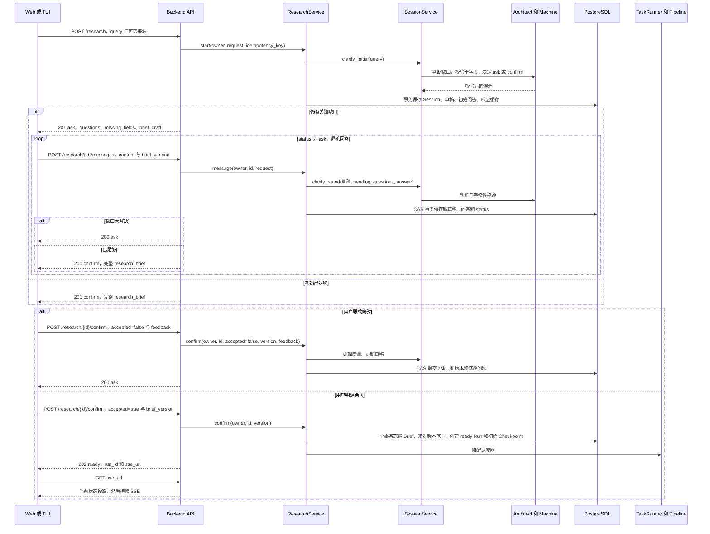
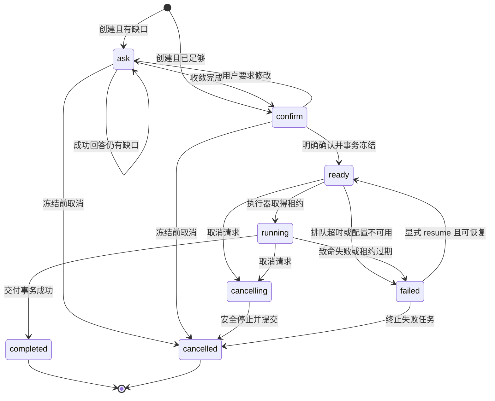
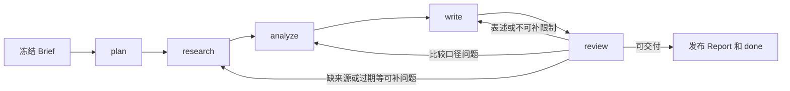
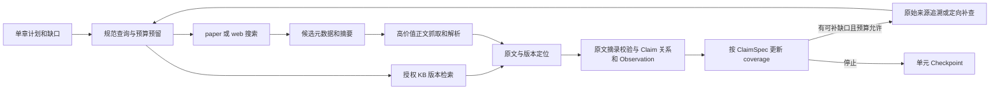
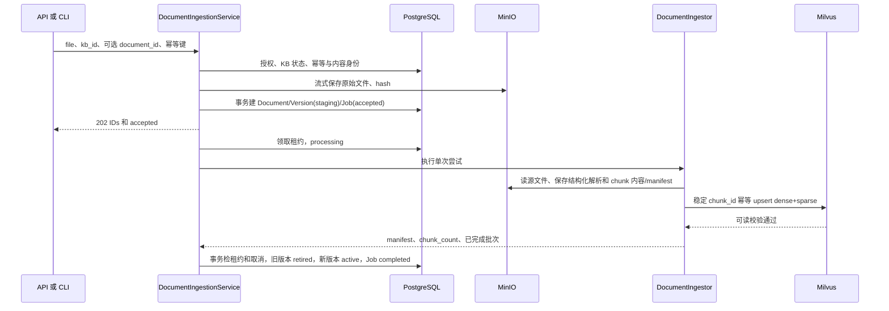
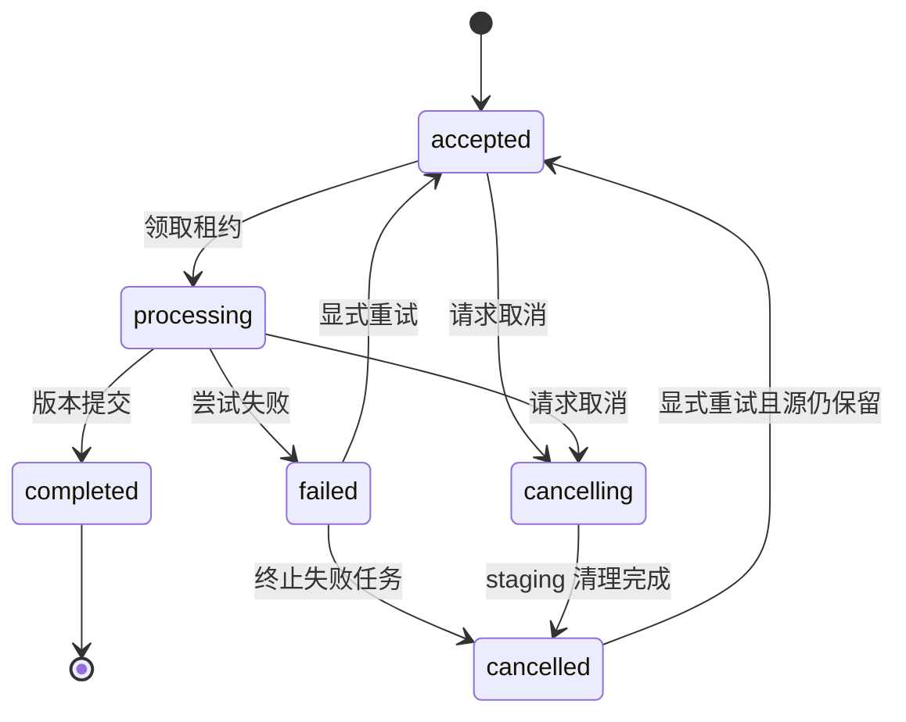

# DR4A 后端数据流与状态设计

> `mono-v1` 目标基线。实体见 [data-model](data-model.md)，精确请求见 [API](api-contract.md)，故障参数见 [operations](operations.md)。图表示调用/数据移动；状态图表示合法转换。

## 1. 共同执行规则

入口先解析身份、校验 DTO，再调用 App Service；Service 校验资源归属和状态。每个可写请求先获得幂等请求身份，读当前 revision，模型/外部 I/O 在 PG 事务外，结果以 CAS 在短事务提交。失败时旧已提交状态不变，不产生半条成功消息。内存 per-resource lock 只是降低竞争；最终正确性依赖 PG revision、唯一约束和租约。

持久状态更新后才发布 phase/rework/done。query_started 等进度是尝试诊断，可在外部调用前广播，但不表示结果已保存。读端点与 SSE 连接没有启动、恢复、修改状态的副作用。

## 2. Research：从请求到冻结

### 2.1 客户端—API 交互时序

每轮交互不是服务端阻塞等用户的 while。一个 HTTP 请求完成一次判断并返回；跨轮状态在 PG。来源选择随初始请求保存；用户在 Clarify 中要求改来源时，assessment 只能提出说明，实际 source_selection 更新由 Service 按 API 的 source_selection 字段校验，不能让模型指定任意他人的 KB。

### 2.2 初始与后续 Clarify

1. start 分配 session_id，解析 query、task_type 提示与 SourceSelection；验证 KB 归属、隐私/模型兼容。先做 Architect 判断，再事务创建资源。初始模型失败返回 503，不暴露不可用的半创建 Session；幂等请求可重试。
2. Architect 输入有界草稿、原始 query（长度受限）、来源选择、最新 answer、pending_questions。输出 ClarifyAssessment；代码拒绝未知字段、非法 enum、超过两个问题、伪造 status。
3. 合并 brief_patch；assumptions 折入 Brief.assumptions；对非关键缺项填披露的保守默认。判定缺口时结合字段缺失和 field_reasons，不只检查三字段。
4. task_type/decision_goal/research_object/deliverable 必须明确；scope/comparison_scope 等只在不改变研究决策的情况下允许保守默认。“列出待验证假设”可满足 claims_to_verify，不需要把未研究事实写成真。
5. 代码完整校验通过、无关键语义缺口 → confirm，pending_questions/missing_fields 为空；否则 ask，1–2 个高信息增益问题，返回更新草稿。
6. 初始 clarification_round=0；每次成功 messages 或 accepted=false 增 1；幂等重试不增。默认最多三次后续自动模型澄清。到上限仍有关键缺口时保持 ask、limit_reached=true，返回明确缺口；后续用户仍可经 messages 提交完整 brief_patch，不再消耗自动模型轮次。不能自动冻结或丢弃请求。
7. confirm 阶段不得通过 messages 改草稿，必须 accepted=false。退回响应固定 ask，即使反馈后字段齐全，也提出“还有哪些范围需要调整”的问题，missing_fields 可为空；下一次回答或完整补充可进入 confirm。未达自动轮次上限时处理反馈可调用模型，失败返回 503 保留原 confirm；已达上限时不调用模型，保留原草稿、保存反馈并要求用户通过 messages 提交明确 brief_patch，退回仍增加 version/round。
8. 用户确认带当前 brief_version；Service 再检字段/hash/归属/来源范围，冻结版本并记录 confirmed_by。同事务创建唯一 Run、保存 seq=1、phase=plan 初始 State 和 ready Session。capacity 暂满保持 ready 排队，返回 202；不是虚构已执行。
9. 已接受的确认网络重试返回原 202 ready 响应，不创建第二 Run；实时状态以 GET 为准。确认旧版本或 accepted=false 改已冻结 Brief 返回 409。

### 2.3 Session 生命周期

在创建/Clarify 同步失败前，不提交新状态。failed 用于已经接受 Run 的执行失败；源暂时不可用可降级而不改变 status。完成/取消后禁止继续问答/恢复；读取仍可用。

## 3. Pipeline：持久执行与阶段读写

### 3.1 每次执行循环

1. TaskRunner 扫 ready Run，以条件更新取得 lease_owner/token/expires_at，attempt_count+1；同事务 Session 与 Run 改 running。读 Run.checkpoint_seq，不按 phase 最高序。
2. 验证快照 schema/hash、冻结版本和配置兼容；不兼容拒绝恢复。Orchestrator 装载完整 State，phase 表示下一工作。
3. 调用统一 execute_phase(state_slice,context)；恢复时先用 unit_manifest/tool_calls 跳过已提交单元。LLM/SDK 不接收可修改的全局 State。
4. 每个完整单元返回 result；代码验证允许字段、ID 回链与预算。追加 research 事实按稳定身份去重；派生产物按作用范围替换；合并产生新 State。
5. 单元提交 seq+1 完整快照，phase 不变；Run.seq 更新与 Session 当前投影同事务。phase 输出全部完成后，Machine 计算下一个 phase，提交新 seq/phase。
6. 只有持有当前 lease_token 且状态 running 的执行器可提交。cancel_requested 已存在时，当前 I/O 完成后先安全停止，不继续提交完成报告。
7. 发出对应已提交进度/phase/rework 事件；重新检查取消、deadline 和预算。直到 review 判定可交付，或失败/取消。失败终态也须事务保存 Failure、最后安全 Checkpoint、Run/Session.failed；PG完全不可用时只能发诊断error，待恢复扫描确认事实，不发伪造done。
8. 完成事务写 Report、State.final_report、phase=done、Run/Session=completed，释放租约。事务后 done.completed；任一写入失败不能发布完成。

phase=done 仅表示无需再执行阶段，不等于审核 approved。failed/cancelled 保留最后 next-phase 和 Checkpoint，不能人为设 done。

### 3.2 正常阶段与返工

| phase | 前置与输入 | 结果及提交门 |
|---|---|---|
| plan | 完整冻结 Brief、SourceSelection、固定骨架 | section_1..5 完整计划，至少一 ClaimSpec/查询；schema/覆盖检查；空计划失败，不进入 research |
| research | 计划、范围、已有事实、指定缺口 | sources/evidence/claims/links/observations/coverage；合法定位、原文、全部 Spec 有覆盖或 Gap |
| analyze | 计划、事实、Observation、分析要求 | metrics/comparison_sets/artifacts 与可比性 Gap；无量化要求合法跳过，记录原因 |
| write | 完整计划、局部证据链、Gap、已验证 Artifact、历史草稿/反馈 | 同版 DraftSection/Binding、任务专属 payload；所有必需章节与事实绑定 |
| review | 当前完整草稿、同版 Binding、事实/比较/Artifact/覆盖、历史问题 | 新反馈、旧问题复核、verdict；未知目标或错版本拒绝 |
| done | 发布前所有门通过 | FinalReport 及不可变 Markdown、references、risks |

### 3.3 Research 的证据路径与受限递归

papers/web 同查询并发、有源独立 timeout；local 只在明确选择 KB 时调用，不访问 default 隐式库。候选摘要不进入关键引用链；只获取高价值全文。摘录提取失败、原文不可达 → Gap，不编造页码。搜索失败和真正空结果区分记录；追溯默认深度 2，每 ClaimSpec 最多 2 次补查，无新增证据或重复 query 停止。

初始研究单元优先使用该章 `retrieval_anchors` 的去重检索表达；无 anchors 时兼容使用 `sub_questions`。没有研究子问题的纯建议章只更新 coverage，不因背景 anchors 自动发起搜索。子问题解释研究需求，ClaimSpec 仍是覆盖判断单位；anchor 不是证据。明确 arXiv 编号可由该来源 Adapter 转成标准 `id_list` 定位，不能把页码/hash 等操作性问题当作全文检索目标。单元 ID、工具授权和账本使用实际检索表达；Adapter 不自行增添模型调用或未授权检索。

本地命中先登记 DocumentVersion 级 SourceRecord，再按 chunk Location 建 Evidence；chunk_id 不能冒充未登记 source_id。gap_fill/citation_trace 的结果必须重新建 ClaimEvidenceLink/Observation、更新目标 coverage，不能只追加全局资料就认为补齐。

### 3.4 Analyze、Write 与 Review

DataAnalyst 按 AnalysisRequirement 分组；基于原文补齐有依据条件与单位，缺项标记；程序对每 ComparisonSet 判断兼容。不同 dataset/protocol/指标定义不能数值排序；partial 限于可解释的条件对照。CodeCrafter 只用 compatible、满足操作参数的组，固定模板编译，沙箱产物保留完整 input_metric_ids → observation → evidence 回链。

Writer 根据每章实际关联选择材料，不截取“全局前 20 条”。上下文超长分批取证或生成，预算耗尽明确失败/缺口，不能静默丢主张。每次 write 的 draft_version+1；未修改章节和绑定一起复制到新版本，已修改章节旧绑定替换。section_3 与其他章同样审核和绑定，不在审阅之后额外生成不受审计的模块。

Critic 先确定性检查 Schema/引用/原文定位，再对**实际草稿文本**及链路做语义判断。记录 reviewed_draft_version，复核旧 issue 的证据或收缩处理；resolved=true 须有 resolution。LLM 未报问题不表示空 Binding 自动通过。

| 未解决 critical/major 类型 | Machine 动作与下游范围 |
|---|---|
| missing_source，fillable=true | re_research，限定 gap/Claim/章节 |
| missing_source，fillable=false | acknowledge_limit，Writer 移除无支撑事实并保留风险 |
| comparability_violation | re_analyze，重建比较组及相关 Artifact，然后 write/review |
| hallucination | 撤回当前无依据结论；可取证时 re_research，否则 acknowledge_limit |
| overclaim | revise，收缩表达，然后 review |
| outdated / logic_error | re_research，核实版本/条件；不可补则 acknowledge_limit |
| 未知 issue_type | Schema 错误；人工/系统诊断，不默认为 done |

多个动作以 research > analyze > write 顺序合并，保存所有目标。minor 仅作为风险/建议，不触发自动回流。每次额外回流 rework_count+1，最大 3；预算耗尽或无新增有效证据停止相应补查。保留最后一次“限制收缩 write + review”的预算，该轮禁止新检索或新计算。所有关键缺陷已消除 = approved；消除错误断言但保留已披露限制 = approved_with_risks；尚有研究覆盖未解决且不伪造事实 = needs_more_work。若连结构、绑定或安全收缩都做不到，Run.failed，无最终 Report。达到上限不能直接 approved。

### 3.5 返工的派生产物失效

Research 只追加新事实与关联，不能把旧来源偷偷替换。来源版本变化新 ID；受影响 Claim 再计算 status。追加/变更事实使相关 comparison_set/artifact/草稿/审核失效。重新 analyze 替换目标组并删失效 Artifact；重新 write 替换目标章且全局 draft_version+1。未受影响章节保留内容与绑定；review 仍检查完整新草稿。Checkpoint 保存失效范围，恢复不能把旧稿与新反馈拼接。

## 4. 状态、报告、SSE、取消和恢复

- GET Session 从 sessions + research_runs 的一致投影读；展示 ask/confirm 可恢复交互，ready/running/cancelling 展示运行，failed 提供 resume_allowed/failure。
- GET report 只读发布版本。未发布返回 409，缺/非 owner 404；不能把 writer.final_report 候选当成发布。
- SSE 先认证与归属检查，再注册独立队列，然后读取持久状态：活动 Run 发送当前 phase 投影；终态发送 done 并关闭。读取后来的广播时用 checkpoint_seq 去除旧持久投影，避免注册与读取竞态。无 phase 的会话拒绝 409。最后一条完成事件丢失时重连仍能从终态生成 done。
- 同 session 的多个订阅者广播而非竞争 queue.get。慢消费者触发断开；客户端 GET 状态重建，不声称支持 replay。
- ask/confirm 取消同事务直接 cancelled；ready/running 取消写 cancel_requested_at 并改 cancelling，202 返回接受状态。runner 在查询、章节、LLM/分析步骤后检查；取消后不启动新 I/O，checkpoint 最后安全 State，Run/Session cancelled，done.cancelled。
- 如果 cancel 与发布完成竞争，PG 行锁/CAS 决定：先提交 completed 则取消返回 409；先提交 cancelling 则完成事务不能赢。不是“晚一个事件”决定最终状态。
- POST resume 只允许 failed 且 resume_allowed，无取消请求；确认配置/快照兼容，CAS 改 ready、保留 Run ID/预算/seq、清 failure，调度新 attempt。后台不会因为 GET events 自动恢复。
- 启动扫描 ready、accepted、deleting；租约过期 running → failed(interrupted) 等显式 resume；processing 入库按可恢复规则重新排 accepted。取消状态在重启后继续清理/停止。

## 5. 知识库管理与删除

create：PG creating → 幂等确保 partition/schema → PG active。201 active；依赖失败返回 503（包含 kb_id），保持 creating 可由扫描器恢复。不得创建同名另一个 KB 来绕过失败；重放同幂等请求等到成功再返回原资源。

delete KB：事务 active/creating → deleting（revision+1）并写清理起点 → 202。禁止新 ingest/search；取消或等待所有旧 Job 租约退出；删除 partition；删除该 KB 对象；PG active_version_id 清空、版本 retired、Documents deleted；KB deleted。每步幂等、逐步保存 cursor；失败保持 deleting。Document 删除同逻辑但只清该 document 的版本和索引。不得先删 PG 元数据导致无法定位外部对象。

删除与确认竞争在冻结事务锁 KB 行：确认先提交则 Run 保存版本引用；删除先提交则确认失败。之后运行中遇到已删除来源记 Gap；已进入 Checkpoint 的原文证据保留，不能用一个新版本替代。删除 KB 不是删已生成研究成果的接口。

## 6. 文档入库与版本可见性

上传先有对象再有可执行 Job；上传途中失败没有 accepted Job，临时对象按 TTL 清理。没有分布式事务；PG 事务失败后的未引用对象可清理，不能产生可见版本。相同内容请求在唯一约束处收敛到同 Job；孤儿对象可安全回收。

解析保留 text/table/formula 结构和页码，文本按段落有界切分，表格/公式是完整原子块；过大块明确拒绝或记录缺口，不能丢脚注。embedding_anchor 使用标题/章节/正文语义；表格 caption+列头+Note，公式前后解释；不只嵌入数字。正文和 anchor 不同，重排用完整正文。

Ingestor 每批通过 Service 的进度回调提交 manifest/progress；token 失效即停止。完成需要：非空有效 chunks、每个对象 hash 校验、索引 upsert、强一致可读验证、PG 提交 Chunk/版本/Job。旧 active 在 staging 失败时仍可检索。重试同版本/ID/Job，成功历史不改写。

取消 Job 进入 cancelling，停止新批次、删 staging 向量/对象（原始源和元数据按保留政策保留），version=failed；清理失败继续 cancelling。不可取消 completed。retry 允许可恢复 failed 或清理已完成 cancelled，源仍存在、次数未耗尽、KB/Document active；重试将 version.failed → staging，清取消请求，attempt_count 在领取时增加，历史尝试保留。

## 7. 在线检索

1. owner/KB/status 校验；在 PG 取 active DocumentVersion（或 Research 冻结的、仍 active/retired 且未删除版本）。过滤 document_ids 时每个必须属于该 KB，不存在不能 silently 忽略。
2. 编码 query 为真实 dense+sparse；Milvus 在同 KB partition、版本 allowlist、类型/年份过滤下分别召回，RRF 融合，候选量有界。
3. 在 PG 验证返回 chunk/version 归属与可见性，读 MinIO 完整正文及 hash，**先读正文再 cross-encoder 重排**。损坏命中返回明确依赖/内容错误，不能用 embedding_anchor 冒充正文。
4. BGE Reranker 用 query+正文重排；不可用按 allow_rerank_fallback 政策返回融合顺序，并在顶层及 trace 声明降级。
5. 返回 RetrievalResult；没有匹配才 items=[]。Milvus/Embedding/MinIO 不可用返回结构化错误。Research 可按来源可选性标 Gap 继续，但底层不能把依赖故障返回空数组。
6. 返回前再次验证删除屏障；发现 KB/Document 正在删除时取消该读，不向调用者发布删除后的新命中。并发替换版本时，本次读使用起始选定版本，不能混正文与向量两个版本。
