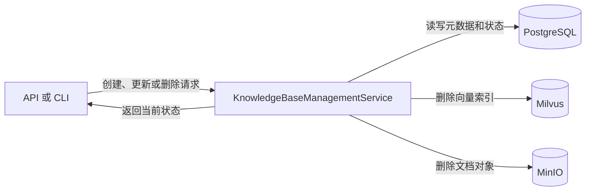
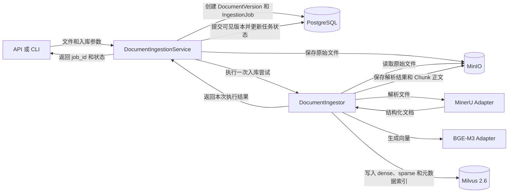
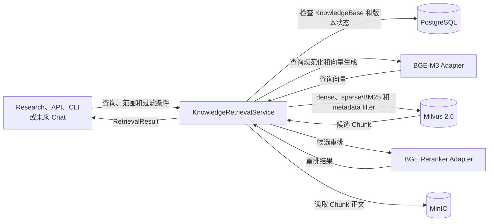
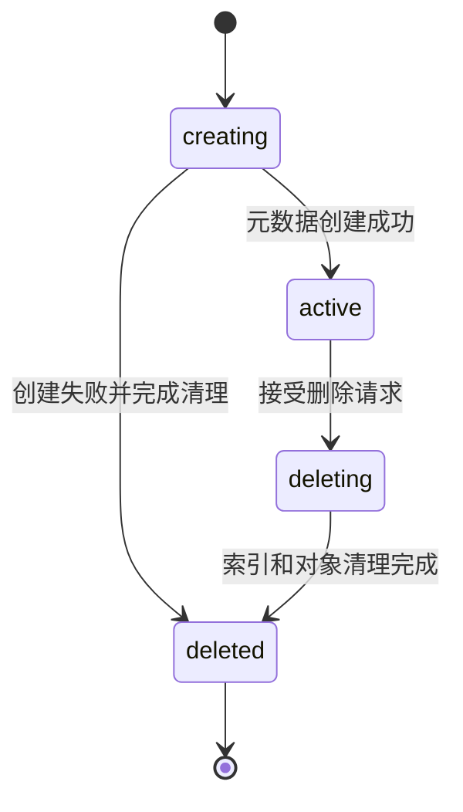
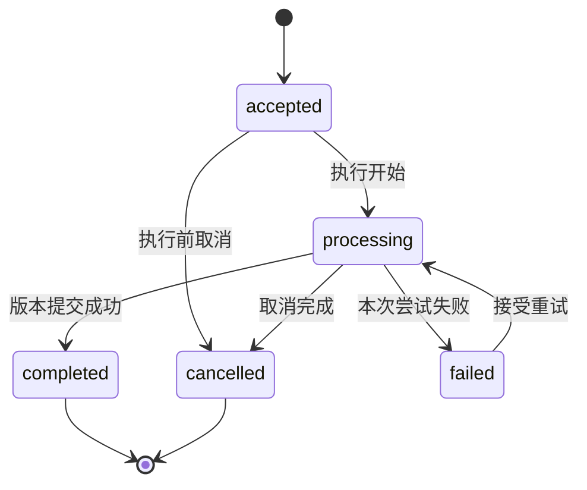

# DR4A 后端数据流与状态设计

> 状态：编写中。本文只记录知识库三个 App Service 的初步数据流和生命周期。其他部分仍是骨架。本文不是当前权威设计来源。

## 1. 文档范围与阅读规则

本文定义数据怎样移动，以及状态怎样变化。本文不重复定义模块职责、对象字段、方法签名和重试参数。

每张图的箭头必须说明调用或数据移动。状态图只显示状态转换。

## 2. Research 会话与 Pipeline

> 待编写。本节将记录 Clarify、Brief 冻结和 Research Pipeline 的数据流。

## 3. 知识库数据流

### 3.1 KnowledgeBase 管理

`KnowledgeBaseManagementService` 管理 KnowledgeBase 元数据和生命周期。创建请求先写入 PostgreSQL。删除请求先把 KnowledgeBase 标记为 `deleting`。系统完成索引和对象清理后，才把它标记为 `deleted`。

*图 1　KnowledgeBase 管理数据流。箭头表示用例调用或数据移动。*

### 3.2 文档入库

`DocumentIngestionService` 是入库用例的控制者。`DocumentIngestor` 只执行一次入库尝试。

*图 2　文档入库数据流。箭头表示调用、数据移动或结果返回。*

入库使用以下可见性规则：

- 原始文件保存成功后，系统才创建可执行任务。
- `DocumentIngestor` 完成解析、切片、Embedding 和索引写入后，返回执行结果。
- `DocumentIngestionService` 完成元数据提交后，才把新版本标记为可检索。
- 部分写入不能使未完成版本进入检索结果。

### 3.3 在线检索

`KnowledgeRetrievalService` 为 Research、API、CLI 和未来 Chat 提供一个检索入口。未来 Chat 不是当前功能。

*图 3　知识库在线检索数据流。箭头表示调用或数据移动。*

`KnowledgeRetrievalService` 返回中立的 `RetrievalResult`。Research 将该结果转换为 `Evidence`。未来 Chat 可以把它转换为上下文或引用。

## 4. 知识库生命周期

### 4.1 KnowledgeBase 状态

*图 4　KnowledgeBase 生命周期。箭头表示允许的状态转换。*

处于 `deleting` 或 `deleted` 状态的 KnowledgeBase 不接受新的入库和检索请求。

### 4.2 IngestionJob 状态

*图 5　IngestionJob 生命周期。箭头表示允许的状态转换。*

`DocumentIngestionService` 是此状态机的控制者。`DocumentIngestor` 返回执行结果，但不决定重试、取消或最终状态。

## 5. 其他数据流

> 待编写。本节将记录认证、报告读取、取消和其他跨模块数据流。

## 6. 相关文档

- 模块职责和依赖方向见 [后端架构设计](architecture.md)。
- 实体字段和关系见 [后端数据模型设计](data-model.md)。
- 输入和输出见 [后端 API 契约](api-contract.md)。
- 失败、重试和恢复见 [后端运行与失败语义](operations.md)。
